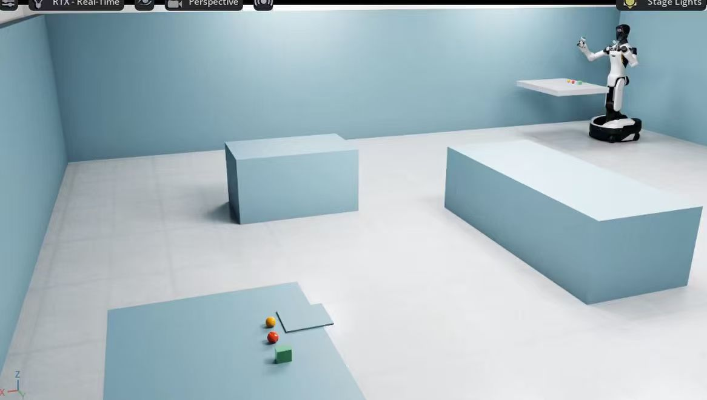
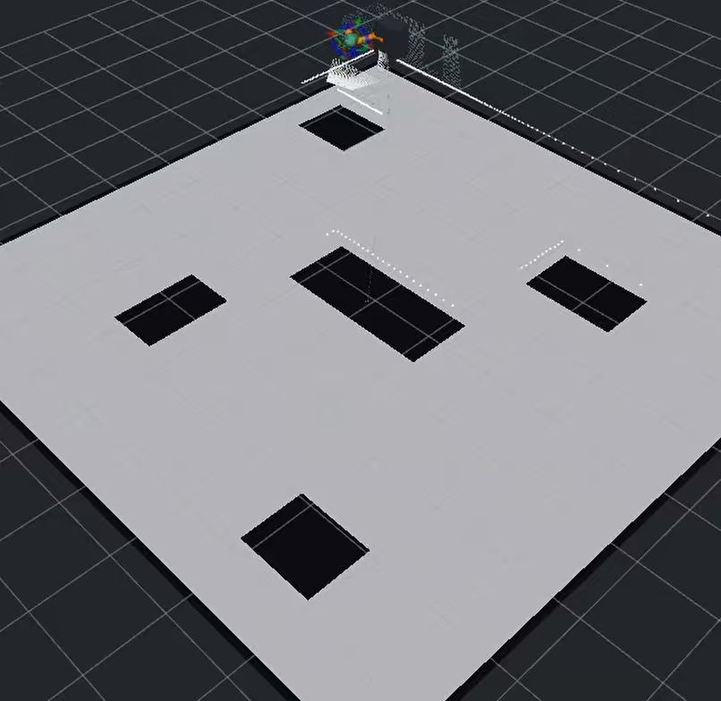
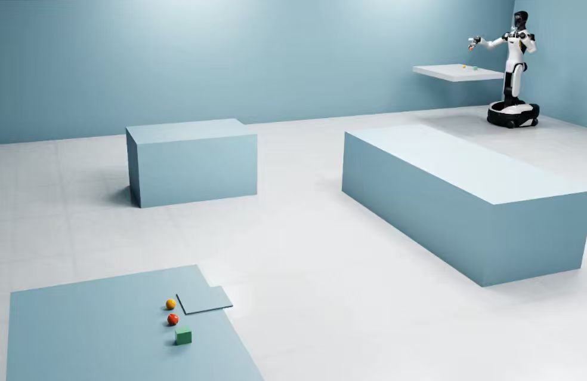
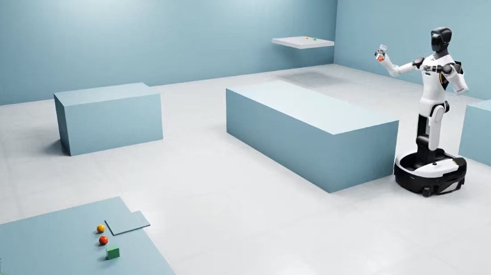
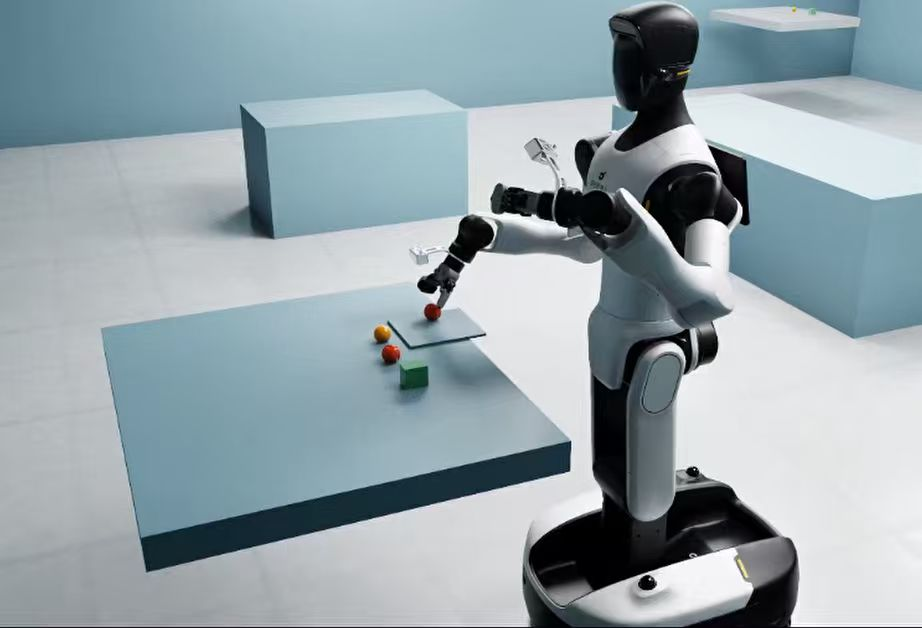
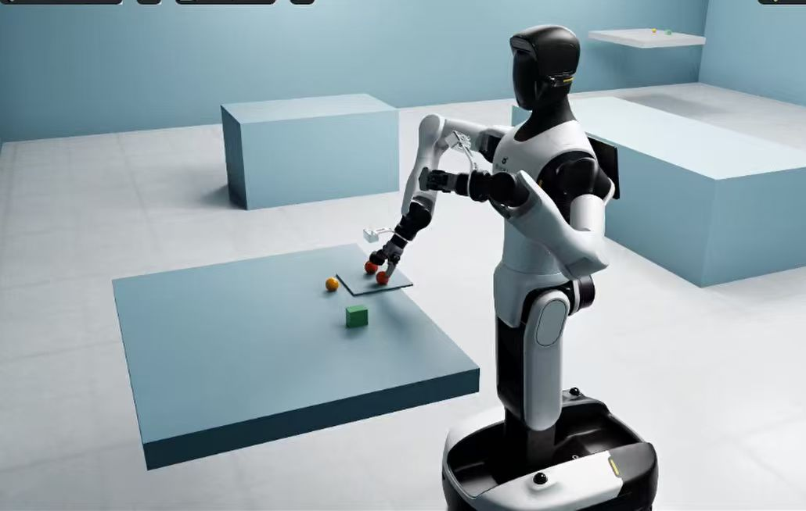

# 第十二章 移动操作综合实践：全场景自主导航操作

第九章让机器人能够“看见桌面上的物体并完成抓放”，第十章解决“底盘怎样绕过障碍到达目标”，第十一章介绍“机械臂怎样规划并执行运动”。本章把这些能力接成一条完整任务链：**机器人先到源桌抓起一颗苹果，带着苹果穿过房间，在远桌停稳并放下，再把远桌原有的另一颗苹果放到同一块接收板上。**

底盘移动后，相机和机械臂的位置都变了；导航报告到达时，机器人未必停在机械臂够得到的位置；夹爪闭合动作成功，也不代表苹果真的被拿起。系统必须约定好坐标、时间、数据接口和动作顺序，并用反馈判断每一步是否真正完成。

对应代码位于 `code/code_chapter12`，ROS 包名为 `g2_chapter12`。本章使用 Isaac Sim 中的 G2 Omnipicker、ROS 2 Humble、Nav2、MoveIt2，以及本章自带的 YOLO 苹果检测权重。左臂保持预设姿态，右臂执行抓放，移动底盘负责两张桌子之间的运输。

开始之前，先明确本案例的范围：

- **“全场景”指当前配置的双桌房间任务，不是任意未知环境中的通用移动操作。** 桌面、接收板、停靠点和障碍布局已知；待抓苹果的位置由在线视觉测量。
- **这是分阶段的移动操作，不是底盘和机械臂同时运动的全身规划。** 导航时收臂并保持夹持，操作时底盘必须停稳。
- **感知使用 YOLO + RGB-D + 几何候选，不调用 SAM2、GraspGenX、VLM 或 VLA。** 第九章提供了方法基础和检测权重，但运行本章不需要启动第九章，也不需要重新训练。
- **仿真传感器有所简化。** 默认地图由已知场景生成；激光是二维栅格射线模拟，里程计来自 Isaac 中底盘实际位姿，而不是带漂移的编码器估计。苹果抓取坐标不读取仿真物体真值，但不代表整个系统完全不用仿真真值。


正文前三部分讲系统原理、数据流和源码对应关系，不穿插可执行代码；第四部分集中给出环境准备、安装、启动和任务结果说明。建议先读懂“谁把什么数据交给谁”，再进行实际操作。

---

## 第一部分 从一次搬运任务理解系统：模块、接口与共同约定

### 1.1 系统究竟要完成什么，什么才算完成

两张桌子上各有一颗苹果和两个干扰物，干扰物为橙子与茶盒。远桌还有一块接收板，上面配置了两个放置槽位。这里的“槽位”是任务中的二维目标位置，不是通过视觉自动识别的凹槽。

任务输入来自两类信息：一类是 `config/task.yaml` 中的已知布局和动作参数，另一类是运行时收到的传感器、TF、关节反馈和 action 结果。任务输出也有两层：ROS 层输出导航目标、关节轨迹、夹爪命令和任务状态；物理层应该出现两颗苹果分别稳定留在指定位置的结果。

完整过程可以按下表理解：

| 任务阶段 | 此时要解决的问题 | 主要依据与通过条件 |
|---|---|---|
| 等待就绪、收臂 | 系统是否具备执行能力 | action 服务端就绪，TF 和关节反馈有效，右臂到达 `home`，夹爪张开 |
| 前往源桌 | 底盘是否处在可操作的位置 | Nav2 到达后停稳，必要时精靠，再复核实际位置和朝向 |
| 源桌感知与抓取 | 夹哪里、怎样靠近 | 新鲜 YOLO RGB-D 候选，有效 IK 和规划结果，夹爪闭合反馈 |
| 抬升与收臂 | 苹果是否真正被拿起 | 连续视觉观测确认抬升，持物回到 `home` |
| 持物导航至远桌 | 移动过程中是否仍在持物 | 收臂互锁、夹爪开度监测、Nav2 导航与精靠 |
| 放置第一颗苹果 | 苹果是否留在槽位 0 | 转移、下降、张开、撤离，随后连续观察指定槽位 |
| 抓放远桌苹果 | 不要把刚放好的苹果又抓走 | 感知排除接收板区域，重新生成候选，放入槽位 1 |
| 最后收臂 | 是否可以结束任务 | 第二次放置验证通过，右臂回 `home`，切换 `IDLE`，发布 `DONE` |


**图 12-1｜先搬一颗，再整理另一颗。** 图中用 A、B 区分两颗苹果的来源，接收板展示的是任务结束后的目标状态。沿编号理解“源桌抓取 → 持物导航 → 远桌两次放置”，再对照上表看每一步的通过条件；这是不按比例的概念图，不是仿真截图，虚线也不是实际规划路径。

`home` 在这里是七个右臂关节角构成的收臂姿态，**不是房间起点，也不意味着底盘最后会开回出发位置**。任务结束时，底盘仍在远桌附近。

`src/mission.cpp` 使用有限状态机组织上述过程。可以把状态机理解为一张严格的工序单：只有当前工序满足条件，才允许进入下一步。常见状态名包括 `WAIT_READY`、`STOW`、`NAVIGATE`、`SETTLE`、`DOCK`，以及带 `SOURCE_`、`DESTINATION_` 前缀的 `PERCEIVE`、`APPROACH`、`CLOSE`、`LIFT`、`HOME`、`TRANSFER`、`PLACE`、`RETREAT` 和 `VERIFY_PLACE`。

源码在前往源桌之前还发布 `NAVIGATE_SOURCE`，随后通用导航函数会发布 `NAVIGATE`。因此，日志中看到通用导航状态不代表源桌阶段被跳过。任务前缀也表示被处理苹果的来源：在远桌执行的 `SOURCE_PLACE`，含义仍然是“放置从源桌带来的苹果”。

任一关键环节失败都会进入 `FAILED`。失败处理会请求取消相关 action、让底盘停止、让机械臂保持，并避免无条件张开夹爪。当前没有自动重新抓取、中途恢复或自动把物体放回出生位置的任务分支。

### 1.2 三组进程怎样协作，为什么不全部写在一个脚本里

本工程分成三组独立启动的进程。

**第一组是仿真与桥接。** `sim/simulation.py` 创建单一 Isaac World、房间、桌面、物体、机器人和相机，执行物理步进；`sim/bridge.py` 把这些结果发布为 ROS 消息，并接收速度、关节目标和运动模式。前者不直接订阅 ROS，后者才是 ROS 与仿真之间的入口。

**第二组是 ROS 能力系统。** `launch/system.launch.py` 启动定位或建图、Nav2、MoveIt2、`robot_state_publisher`、控制器、感知节点，以及可选的 RViz。它负责提供能力，**启动后不会自动开始搬运任务**。

**第三组是任务编排。** `launch/mission.launch.py` 启动 C++ 程序 `mission`。它不操作 Isaac 中的苹果对象，不直接设置关节，而是调用 Nav2、MoveIt2 和夹爪提供的标准接口。

可以把三者理解成：仿真提供“身体和感官”，ROS 能力节点提供“走路、规划、识别和执行技能”，任务节点决定“现在该做哪件事”。这样既能替换单个模块，也便于区分错误究竟出在感知、规划还是执行。


**图 12-2｜三个终端不是三个独立任务。** 启动时按 A → B → C；读调用关系时从上往下看“任务 → 能力 → 物理执行”，再沿向上的箭头看反馈。左侧虚线表示任务状态也会送到桥接用于诊断，不是任务节点绕过控制器直接修改关节或苹果位姿。

| 模块与源码 | 主要输入 | 主要输出 | 不负责什么 |
|---|---|---|---|
| 仿真：`sim/simulation.py` | 本地资产、场景配置、桥接传来的目标 | 物理状态、RGB-D、实际关节与底盘位姿 | 不决定下一步任务 |
| 消息桥：`sim/bridge.py` | `/cmd_vel`、`/isaac/joint_command`、`/motion_mode` | `/clock`、`/odom`、`/scan`、相机、关节和 TF | 不求解 IK，不提供轨迹 action |
| 地图工具：`g2_mobile/mapping.py` | 墙体、桌子和障碍占地 | 参考地图；供桥接使用的模拟激光距离 | 不执行 SLAM 优化 |
| 定位或建图 | 地图、激光、里程计与 TF | `map → odom`；SLAM 模式还输出地图 | 不生成抓取姿态 |
| Nav2 | 导航目标、地图、激光、定位与里程计 | 全局路径、底盘速度、导航 action 结果 | 不判断夹爪是否抓到苹果 |
| 感知：`g2_mobile/perception.py` | 同帧 RGB、深度、内参、点云、TF、任务状态 | 物体观测中心与抓取候选 | 不执行机械臂，不读取苹果真值 |
| MoveIt2 | 机器人模型、关节状态、TF、碰撞场景、运动目标 | IK 解、规划轨迹、执行结果 | 不直接写 Isaac 关节 |
| 控制器：`g2_mobile/controller.py` | 标准 action、完整关节反馈、里程计、模式请求 | 关节目标、模式许可、action 反馈和结果 | 不搜索无碰撞路径 |
| 编排：`src/mission.cpp` | 配置、感知、反馈、action 结果 | 各模块调用、任务状态 | 不训练模型，不修改物体位姿 |

这里特别容易混淆的是两个“控制器”：Nav2 的局部控制器负责从底盘路径得到速度；本章 Python 控制器负责机械臂与夹爪 action，并管理运动互锁。它们不属于同一层。

Isaac 侧使用自己的 Python 运行时，ROS 侧使用 `/usr/bin/python3`。两边通过 DDS 传递基础消息，而不是互相导入对方的 Python 二进制模块。标准 `control_msgs` action 服务端放在系统 ROS Python 中，正是为了避免混用两个运行时的 ABI。`run.sh` 已经分别处理这两套环境，不应通过手工拼接 Python 路径把它们合并。

### 1.3 把接口看成合同：消息中到底装了什么

ROS 接口可以简单分成三类：topic 持续传数据，service 完成一次请求与响应，action 管理需要等待、反馈和取消的长动作。导航和机械臂运动使用 action，是因为任务不仅要知道“命令发出”，还要知道“有没有接受、是否完成、何时取消”。

下表列出读懂本章最重要的数据接口。绝对话题名以 `/` 开头，名称应以当前源码为准，不要自行替换成其他章节的接口。

| 接口 | 类型 | 数据含义与调用关系 |
|---|---|---|
| `/clock` | `rosgraph_msgs/msg/Clock` | 桥接发布的仿真时间，本系统只应有一个有效发布者 |
| `/odom` | `nav_msgs/msg/Odometry` | 底盘位姿和实际运动速度；定位、Nav2、停稳互锁都要用 |
| `/scan` | `sensor_msgs/msg/LaserScan` | `base_scan` 下的二维模拟激光距离 |
| `/camera/color/image_raw` | `sensor_msgs/msg/Image` | `rgb8` 彩色图像 |
| `/camera/depth/image_raw` | `sensor_msgs/msg/Image` | `32FC1` 光轴深度，桥接输出单位为米 |
| `/camera/camera_info` | `sensor_msgs/msg/CameraInfo` | 图像尺寸、焦距、主点等相机内参 |
| `/camera/points` | `sensor_msgs/msg/PointCloud2` | 相机坐标系下的 XYZ/RGB 点云；用于显示及感知输入同步检查 |
| `/joint_states` | `sensor_msgs/msg/JointState` | 只包含 URDF 中的右臂七关节，供 MoveIt 和 RSP 使用 |
| `/isaac/joint_states` | `sensor_msgs/msg/JointState` | 完整仿真关节反馈，包含夹爪，供本章控制器检查 |
| `/grasp_candidates` | `geometry_msgs/msg/PoseArray` | `odom` 下多个 TCP 位姿；每个位姿包含米制位置与 `xyzw` 四元数 |
| `/target_center` | `geometry_msgs/msg/PointStamped` | `odom` 下当前目标的视觉观测中心，用于抬升与放置检查 |
| `/mode_request`、`/motion_mode` | `std_msgs/msg/String` | 前者是任务/遥控请求，后者是控制器实际批准的 `NAV`、`ARM` 或 `IDLE` |
| `/task_status` | `std_msgs/msg/String` | 任务阶段；采用 transient-local，后加入的订阅者可接收保留状态 |
| `/cmd_vel` | `geometry_msgs/msg/Twist` | 车体坐标下的 `linear.x`、`linear.y`、`angular.z`，单位为 m/s、m/s、rad/s |
| `/isaac/joint_command` | `sensor_msgs/msg/JointState` | 严格按约定名字发送的右臂关节目标，或单独夹爪关节目标 |

`/grasp_candidates` **不是轨迹**，没有各关节随时间的序列，也没有显式的置信度、夹爪宽度或物体 ID 字段。候选顺序由几何生成器决定，任务按顺序尝试。内部计算出的夹持宽度只用于可行性筛选，并没有作为另一个控制量发送出去。

`/target_center` 与抓取位姿中的位置也不必完全相等：前者是点云中位数观测，后者会结合目标高度调整夹持中心。不要把用于“验证物体在哪”的点，直接当成“TCP 应该去哪”的完整六维目标。

主要动作与服务的调用链如下：

| 调用者 → 服务端 | 接口 | 请求与返回 |
|---|---|---|
| `mission` → Nav2 | `/navigate_to_pose`，`nav2_msgs/action/NavigateToPose` | 输入 `map` 下目标位姿和本章行为树；返回导航 action 状态 |
| `mission` → Nav2 | `/follow_path`，`nav2_msgs/action/FollowPath` | 精靠输入 `odom` 下短路径，显式选择 `Dock` 与 `dock_goal_checker` |
| `mission` → MoveIt | `/move_action`，`moveit_msgs/action/MoveGroup` | 输入运动规划请求，设置只规划；返回 `planned_trajectory` |
| `mission` → MoveIt | `/compute_cartesian_path`，`moveit_msgs/srv/GetCartesianPath` | 输入当前状态和 TCP 路点；返回轨迹、错误码及完成比例 `fraction` |
| `mission` → MoveIt | `/execute_trajectory`，`moveit_msgs/action/ExecuteTrajectory` | 输入已规划的机器人轨迹，等待执行结果 |
| MoveIt → 本章控制器 | `/right_arm_controller/follow_joint_trajectory`，`control_msgs/action/FollowJointTrajectory` | 输入七关节轨迹和时间点；返回实际执行反馈及结果 |
| `mission` → 本章控制器 | `/gripper_controller/gripper_cmd`，`control_msgs/action/GripperCommand` | 输入开合目标；返回实际位置、到位或受阻状态 |
| `mission` → MoveIt | `/get_planning_scene`、`/apply_planning_scene` | 读取并更新环境、持物碰撞体和允许碰撞矩阵 |
| 操作者 → 本章控制器 | `/estop`、`/reset_estop`，`std_srvs/srv/Trigger` | 锁存软件急停，或在满足条件后复位 |

### 1.4 让所有模块说同一种“位置语言”：TF、单位与时间

同一个苹果在相机坐标中可能位于“前方 0.7 m”，在房间坐标中却是“左下角桌面附近”。坐标不统一，视觉测量和机械臂规划即使各自正确，接起来也会抓错位置。

本章 TF 关系可以按两条主干理解：

- 定位主干是 **`map → odom → base_link`**。`map → odom` 由 AMCL 或 SLAM Toolbox 二选一发布，`odom → base_link` 由 Isaac 桥接根据实际底盘位姿发布。
- 操作主干是 **`base_link → arm_base_link → 右臂各连杆 → gripper_r_center_link`**。桥接提供底盘到机械臂基座的动态变换，RSP 根据 URDF 和关节反馈发布右臂内部变换。桥接还负责 `base_link → base_scan` 与 `base_link → camera_optical_frame`。

`base_link` 取地面投影，轴向为 X 前、Y 左、Z 上；相机光学坐标则是 X 右、Y 下、Z 前。ROS 位姿中的四元数顺序为 `x, y, z, w`，不要和部分 Isaac API 使用的 `w, x, y, z` 混用。相关转换函数已经封装在本地工具中。

`task.yaml` 的房间布局、源桌停靠点、远桌停靠点、接收板和槽位均在当前仿真 `odom` 下定义。机械臂抓取目标和 PlanningScene 也使用 `odom`。Nav2 跨房间目标使用 `map`，所以任务发送导航 action 前要通过 TF 把停靠目标从 `odom` 转到 `map`，而不是假设两者始终重合。

MoveIt 的 SRDF 使用 `odom → arm_base_link` 浮动虚拟关节来描述移动基座。它让 MoveIt 知道机械臂基座当前在哪里，**不意味着 MoveIt 会规划底盘运动**；实际规划组仍然只有右臂七关节。

这里不能再保留固定机械臂示例中的静态 `world → arm_base_link`，也不能为了让 TF 看起来连通而补一条静态 `map → odom`。同一个 child frame 应有明确的发布者，否则不同节点可能同时争夺它的位置。

时间方面有两条规则：

1. **物理与轨迹按仿真时间推进。** ROS 规划、感知和显示节点使用 `use_sim_time=true`，由 `/clock` 驱动。暂停仿真时，轨迹插值不会按照现实时间偷偷向前跳。
2. **通信保护和动作总等待按墙钟计时。** 心跳失联、反馈过期或任务超时，不能因为仿真暂停就永远不触发。

相机发布的 RGB、深度、内参和点云使用同一帧时间戳。感知节点为每种输入缓存最多 8 帧，寻找共同时间戳，并等待那个时间的 TF 到齐；抬升检查还需要同时间的 TCP TF。不能用旧深度、新 RGB，再配“最新 TF”拼成一个看似完整的观测。

本章相机配置为 320 × 240；桥接按步数降频发布 RGB-D，目标节奏约为每仿真秒 5 帧。这不等于墙钟下保证 5 Hz，渲染和 CPU 推理负载都会影响实际运行速度。点云先检查格式与时效，真正用于抓取几何的密集目标点则从 YOLO 框内的原始深度重新反投影，不能把 `/camera/points` 当成已经分好的苹果点云。


**图 12-3｜位置要在同一个坐标系，数据要来自同一个时刻。** 上半图回答“每个坐标系连到哪里、谁发布变换”；下半图回答“苹果点怎样变成抓取目标”。注意两个方向：抓取把相机点变到 `odom`，跨房间导航把配置中的 `odom` 停靠目标变到 `map`；两者都不能省略 TF。

---

## 第二部分 底盘怎样从“到达附近”走到“可以伸臂”：地图、导航与精靠

### 2.1 默认参考地图与可选 SLAM，不是同一件事

默认运行方式使用 `maps/room.yaml` 和 `maps/room.pgm`。它们由 `g2_mobile/mapping.py` 根据 `task.yaml` 的墙体、桌面和障碍占地生成，构建时会重新生成，不是机器人先巡游一圈测出来的地图。

参考地图采用 0.05 m 分辨率，大小为 190 × 190，原点为 $(-4.75, -4.75)$。每个栅格回答的是“这小块平面能不能通过”，不包含完整的三维外观。两张桌子的整个水平占地都被视作障碍，机器人不会计划从桌下穿过。

桥接中的 `/scan` 同样来自这个二维占据栅格：从底盘位置沿 360 个方向射线采样，得到约 0.12～8 m 范围内的距离。它不是 Isaac RTX 激光，也不是对当前 USD 场景实时进行三维射线检测。

因此必须注意一个范围限制：**如果在 Isaac 界面里临时添加障碍，而没有更新本章的栅格定义，模拟激光未必能看见它。** Nav2 确实在处理激光和代价地图，但不能据此宣称本例已经验证任意动态障碍场景。

默认 `slam:=false` 时，`map_server` 加载参考地图，AMCL 接收激光与里程计，估计 `map → odom`。AMCL 可以理解为“在已知地图上用许多可能位置反复比较激光观测”，最后把定位修正告诉其他节点。本例使用 `OmniMotionModel`，与可横移的底盘相配套。

`slam:=true` 时，启动文件不再启动 AMCL 和默认地图定位组合，而是启动 `async_slam_toolbox_node`，让它用激光与里程计构建地图并提供 `map → odom`。此时可以用本章遥控节点带机器人巡游、保存地图，再以定位模式加载保存的结果。

SLAM 分支主要用于理解“建图”和“在地图上导航”的区别。当前默认搬运任务不包含未知环境自主探索，SLAM 建图练习需要使用遥控带机器人巡游。更换地图坐标原点后，还要重新对齐 AMCL 初始位姿，不能只替换地图文件名。

### 2.2 Nav2 的分工：全局选路线，局部选速度

任务给 Nav2 的不是一串轮子转角，而是目标位姿。Nav2 需要把这个目标逐步变成底盘可执行的速度。

**第一步：代价地图把障碍变成“通行难度”。** 全局代价地图在 `map` 下综合静态地图、激光障碍层和膨胀层；局部代价地图在 `odom` 下随车滚动，重点关注车附近的障碍。膨胀层在障碍周围增加代价，使路径不要紧贴桌边或墙角。

当前配置的全局分辨率为 5 cm，局部为 2 cm，局部窗口为 6 m × 6 m，底盘用半径 0.40 m 的圆近似。这个圆不是整个机器人高处机械臂和所持苹果的三维包络。因此，收臂和事先核查房间净空仍然重要；本章没有实现全机身三维导航碰撞规划。

**第二步：NavFn A* 找跨房间路径。** `planner_server` 的 `GridBased` 使用 `NavfnPlanner`，并设置 `use_astar: true`。A* 可以理解为一边累计已经走过的代价，一边估算距离目标还剩多少，优先扩展更有希望的栅格。它输出的是位置序列，不直接输出电机命令。

**第三步：DWB 从当前可用速度中选一个。** `controller_server` 使用 `DWBLocalPlanner` 与 `LimitedAccelGenerator`，采样平面速度组合 $(v_x, v_y, \omega)$，预测短时间内的运动，并按障碍、路径距离、目标距离、朝向、振荡等项评分。碰撞风险高或约束不满足的候选被排除，再从剩余候选中选择较好的速度。

由于 G2 本例是舵轮底盘，DWB 的 Y 向速度并没有被固定为零。桥接收到速度后，再调用本章 `sim/base/` 中沿用第四章的舵轮运动学：对于位置为 $(x_i, y_i)$ 的轮组，先计算局部速度分量 $v_{x,i} = v_x - \omega y_i$、$v_{y,i} = v_y + \omega x_i$，再得到转向角和轮速目标，交给物理关节执行。这条链中，Nav2 负责“整车怎么走”，舵轮控制器负责“每个轮子怎么转”。

**第四步：行为树组织规划、跟踪和恢复。** `config/navigate_to_pose.xml` 每秒触发全局重规划，并把路径交给 `FollowPath`。跨房间导航发生异常时，行为树可以清理代价地图、旋转、等待或后退。它只管理一次导航，不负责整章的苹果搬运工序；整个任务仍由 `mission.cpp` 管理。

本章有两套局部控制与到达检查器，调用时必须显式配对：普通导航使用 `FollowPath` 与 `goal_checker`，精靠使用 `Dock` 与 `dock_goal_checker`。在 YAML 中随意补一个 `current_goal_checker` 不能替代行为树或 action 请求中的选择。

### 2.3 为什么导航成功之后还要停稳、精靠、再复核

设机械臂刚好能从桌边够到苹果，底盘比计划位置后退了 8 cm，导航仍可能认为已经到达，但机械臂的 IK 可能已经无解。底盘朝向偏一点，TCP 的可达区域也会旋转。对导航而言很小的误差，对桌边抓取不一定小。

此外，当前 NavFn 配置允许在目标附近 0.15 m 范围搜索可用终点，普通导航到达检查器的 XY/朝向容差是 0.08 m/0.12 rad。**Nav2 的 action 成功只说明它满足了导航自身条件，不等于满足本章伸臂条件。**

`mission.cpp::navigate_to()` 因此把导航分成一个完整的“到站流程”：

1. 从 `task.yaml` 读取 `odom` 下的停靠目标，转换为 `map` 位姿，调用 `/navigate_to_pose`。
2. 导航返回后发布 `SETTLE`，请求 `ARM` 模式。控制器只有确认实际里程计速度连续满足停稳条件超过 0.5 s，才会批准。
3. 读取新鲜的 `odom → base_link`，比较底盘实际位置、朝向与原始停靠目标。
4. 如果尚不合格，在允许范围内生成一次 `odom` 下的短路径，进入 `DOCK`，请求 `NAV`，调用 `/follow_path`。
5. 精靠完成后再次 `SETTLE`，切换到 `ARM`，连续复核 0.5 s，并确认 TF 确实在更新。

短路径由 `src/docking.hpp` 生成，连接当前位姿与精确停靠点，角度按最短方向插值。它只允许起点距目标不超过 0.30 m、朝向差不超过 0.35 rad；超出这个范围就失败，而不是把近距离修正当成第二次远距离导航。

`Dock` 使用低速 DWB、局部障碍检查和独立到达检查器，XY/朝向内部容差为 0.025 m/0.02 rad。动作最多等待 45 s，并且不能超过总导航剩余时间。精靠直接调用 `FollowPath`，不执行桌旁旋转、后退等通用行为树恢复动作。

最后，任务以 **位置误差不超过 0.06 m、朝向误差不超过 0.05 rad** 作为伸臂门槛，并检查 TF 时效与运动模式。只要还有一项不合格，就拒绝抓取。

这里有三个不同概念，不要混为一个参数：普通导航容差决定“已到附近”，Dock 内部容差决定“短路径跟踪可以结束”，任务最终门槛决定“现在是否允许伸臂”。任务门槛不能替代控制器正确收敛，也不能靠不断重复发送同一个 `map` 目标来解决精靠问题。


**图 12-4｜到附近、停得准、允许伸臂，是三件事。** 沿蓝色流程看正常到站与精靠分支，绿色表示通过检查后进入下一步，红色表示拒绝继续。图中数值对应本章当前配置；任一步超时、反馈失效或最终复核不通过，都不能因为 Nav2 已报成功就跳到抓取。

---

## 第三部分 从桌边观测到稳定落板：视觉、抓取规划与执行闭环

### 3.1 从 YOLO 框到三维苹果点：先找目标，再清掉背景

本章加载本地 `models/apple_yolo.pt`，优先使用随代码提供的 `vendor/ultralytics`。感知节点默认以 CPU 推理，只选类别名为 `apple` 的检测，置信度阈值来自 `task.yaml`，默认 0.40。橙子与茶盒用于构成干扰，而不是第二、第三类搬运任务。

模型输出的是图像中的矩形框。矩形框内既有苹果，也有桌面，不能简单把矩形中心乘上一个深度值就认为找到了可靠抓取点。本章采用已知桌面约束下的几何筛选，而不是 SAM2 实例分割。

对于像素 $(u, v)$、光轴深度 $z$ 和内参 $(f_x, f_y, c_x, c_y)$，反投影为：

$$
X_c = \frac{(u-c_x)z}{f_x},\qquad
Y_c = \frac{(v-c_y)z}{f_y},\qquad
Z_c = z.
$$

这里 $z$ 是沿相机光轴的深度，不是相机到该点的欧氏距离。随后按该帧时间戳查询相机到 `odom` 的旋转和平移：

$$
p_{\mathrm{odom}} = R_{\mathrm{odom}\leftarrow\mathrm{camera}}\,p_{\mathrm{camera}} + t_{\mathrm{odom}\leftarrow\mathrm{camera}}.
$$

这样得到的才是能交给任务和 MoveIt 使用的房间坐标。

普通桌面感知主要经过以下筛选：

- 舍弃无效深度，只使用 0.05～5 m 内的有效像素。
- 按当前桌子的水平范围和桌面上方约 0.006～0.14 m 的高度带去掉背景。
- 以点云 XY 中位数为参考，保留半径约 6 cm 内的点，降低邻近物体混入的影响。
- 检查点数，公共处理阶段至少需要 30 个点；XY 跨度过大时拒绝把多个物体当成一个目标。
- 在 `DESTINATION_PERCEIVE` 阶段排除接收板及其边缘附近的目标，避免重新抓取已放下的源桌苹果。

感知默认 `station=auto`，按底盘当前位置选择最近的一张桌子，再结合 `/task_status` 切换观测用途。因此，任务状态不仅用来打印日志，也会改变感知的目标选择逻辑。

YOLO 不可用时，节点会记录模型故障并禁止产生正常抓取目标，不会退回“找红色区域”或读取苹果的仿真坐标。正常挑选待抓苹果仍需有效 YOLO 检测。模型置信度、有效点数、候选数量和当前阶段会写入感知诊断日志，排错时应先看这些信息。

### 3.2 几何候选解决夹爪朝向，IK 与规划解决手臂怎么过去

苹果点云只描述物体表面，机器人还需要一个夹爪目标姿态。`g2_mobile/common.py::grasp_candidates()` 使用的是适合本教学小物体的 2.5D 几何方法，不是任意物体的完整六维姿态估计。

它先计算点云各轴的 2% 与 98% 分位数，减小少量离群点的影响，再估计目标高度、水平尺寸和夹持中心。抓取高度约取物体高度的 60%，同时不低于桌面上方 2.5 cm；目标高度需在约 2～10 cm，水平尺度也要满足本章夹爪与物体的范围假设。

然后对 XY 点云协方差做特征分解，也就是 PCA。直观地说，PCA 给出点云在平面上主要沿哪些方向展开，用来提出候选偏航角。但苹果接近球形，单视角遮挡会让这些方向不稳定，所以代码先尝试两种预设横向夹持方向，再尝试四种相隔 90° 的 PCA 派生方向，最多得到六个候选，经过宽度筛选后可能更少，也可能存在方向重复。

对于每个方向，代码沿夹爪闭合轴测量投影宽度并增加 6 mm 余量，要求估计值在 0.014～0.074 m 内。夹爪采用倾斜俯抓，默认倾角参数为 0.65 rad，目的在于适应当前桌边布局与腕部可达范围，而不是让腕部必须垂直处在 TCP 正上方。

这一做法有明确边界：桌面高度来自已知配置，倾斜方向与两张桌子同向靠近的布局相配套。若把停靠方向旋转 90°，仅改停靠坐标未必够，还应检查候选朝向与 IK。候选满足几何条件也不代表关节可达，更不代表已经找到整条安全路径。

任务收到候选后，按如下方式调用 MoveIt：

1. `fresh_poses()` 只接受进入当前感知等待之后发布、仍然新鲜、坐标为 `odom` 的非空候选，不使用导航之前缓存的旧结果。
2. 为候选建立预抓取位姿：保持朝向，在抓取点上方增加 0.12 m。
3. `pose()` 以当前关节状态为种子，用 KDL 求满足完整 TCP 位姿的 IK，将位姿目标转换为七关节目标。
4. `planned()` 请求 `/move_action` 只规划，以 `RRTConnectkConfigDefault` 为主要规划器。
5. 返回轨迹成功后，再通过 `/execute_trajectory` 执行，不能把“规划成功”当成“机械臂已到达”。

KDL 回答“有没有一组关节角能到这个姿态”，OMPL RRTConnect 回答“怎样从当前关节状态连接到那组关节角”。RRTConnect 可以理解为从起点和目标两侧逐步探索关节空间，尝试把两侧连起来；它不是简单地让所有关节同时直线插到目标角度。

配置文件还列有 RRTstar 和 PRM，但当前 `mission.cpp` 显式选择 RRTConnect，不会默认轮流运行三种规划器。对候选的尝试也是在线逐个进行，不是预先把整次双苹果任务所有轨迹都规划完成后才执行。


**图 12-5｜检测到苹果，不等于已经知道怎么抓。** 按上排从左到右、下排从右到左阅读：先找框，再提取有效三维点，再提出夹爪姿态，最后检查关节可达性并规划、执行。中间的点阵只是几何处理示意，不是真实传感器输出；每一层都可能拒绝当前目标，候选多也不保证抓取成功。

### 3.3 抓放近距离走直线，碰撞场景与真实接触要分开看

预抓取、持物回 `home`、移动到槽位上方等粗运动使用关节空间规划；最后接近、抬升、下降和撤离使用笛卡尔路径。原因很直观：接近苹果时希望 TCP 朝目标平顺下降，而不是让关节规划器选择一条绕过苹果侧面的自由路径。

`cartesian()` 调用 `/compute_cartesian_path`，使用当前机器人状态与目标 TCP 路点，最大插值步长为 0.008 m，并设置关节跳变检查。返回值中的 `fraction` 表示完成了多少路径，低于 0.999 就拒绝执行，不把“只算出前半段”当成可接受结果。

笛卡尔几何路径还缺少各路点到达时间。代码用 `IterativeParabolicTimeParameterization` 进行时间参数化，速度和加速度缩放均为 0.12，再交给统一的执行 action。普通 OMPL 规划则通过配置中的适配器进行时间参数化，两条分支不要混称为完全相同的处理过程。

规划前，`mission.cpp` 把墙、障碍、桌面与接收板作为已知几何加入 PlanningScene。待抓目标的位置由视觉候选给出，碰撞体用约 5 cm 的立方体作教学近似，尺寸不是实时重建的精确网格。本版没有启用 OctoMap 在线障碍更新，因此相机点云出现在 RViz 中，**并不表示每个深度点已经自动进入 MoveIt 碰撞模型**。

抓住目标后，任务提交 `AttachedCollisionObject`，让 MoveIt 在后续规划中知道“夹爪上还带着一个物体”。释放后移除该附着碰撞体，并撤离夹爪。

需要区分两种完全不同的“附着”：

- **规划附着**是 MoveIt 中的碰撞建模，用来估计持物后的空间占用。
- **物理抓取**是 Isaac 中夹爪、苹果、摩擦和重力的接触结果。

本章不会在 Isaac 中把苹果强制绑定到 TCP，不会让苹果跟随末端位姿，也不会通过瞬移制造放置成功。因此，创建规划附着体并不能证明物理抓取成功，后面仍然需要真实观测。

另一个必须单独说明的机制是 `simulation_grasp_ignore_collisions`。当前默认值为 `true`，任务在抓取窗口开始时保存整张允许碰撞矩阵 ACM，再临时允许相关环境与自身碰撞；笛卡尔请求在同一窗口内也关闭碰撞检查。窗口覆盖预抓取、接近、闭合、抬升和持物回 `home`，返回 `home` 后恢复 ACM，放置阶段恢复检查。

这个开关不会关闭 Isaac 物理碰撞、Nav2 避障、关节限位、IK 或静止互锁，但仍然明显削弱了抓取规划保障。理解和复现默认实验可以保留原值；要研究严格碰撞规划，应将其改为 `false`，重新构建、重启并独立验收。不能承诺只改这一项就仍能沿原路径成功，可能还需要调整停靠点、机器人碰撞模型和候选姿态。

`src/scene_client.hpp` 为 PlanningScene 读写增加了响应等待与超时处理，并尽量保留已有持物信息。正常退出或捕获异常时会尝试恢复碰撞矩阵；若进程被强杀，或日志提示恢复失败，应重启 `system`，不要让下一次任务继承未知状态的 ACM。

### 3.4 标准轨迹怎样变成关节运动，互锁怎样阻止错误时机的动作

MoveIt 通过 `config/moveit_controllers.yaml` 找到本章提供的 `FollowJointTrajectory` action。这里使用的是自定义标准 action 适配器，**没有要求额外启动一个 ros2_control 控制器管理器**。接口标准化不等于内部实现必须使用同一个控制框架。

`controller.py` 收到轨迹后，先验证关节名和顺序、轨迹维度、有限数值、关节限位、严格递增时间、段间速度及从实际状态进入首段的可执行性。右臂七关节是 `idx61_arm_r_joint1` 到 `idx67_arm_r_joint7`，不能发一个长度正确但顺序错误的列表，也不能让控制器自行猜测和重排。

执行时，控制器按仿真时间插值位置。如果第一轨迹点在未来，就从当前实际关节状态向第一点插值，而不是立即跳到第一点。插值目标通过 `/isaac/joint_command` 发送，桥接更新 Isaac 关节驱动目标，物理系统执行后再返回 `/isaac/joint_states`。控制器使用实际反馈检查跟踪误差和末端收敛，而不是只等轨迹时长结束就报成功。

夹爪使用 `GripperCommand`，但本章适配器把 `command.position` 解释为主动夹爪关节角：**0 rad 为闭合目标，0.785 rad 为张开目标，不是以米表示的夹缝宽度。** 若未来替换成真实硬件驱动，必须重新核对并转换接口语义。

开合指令在约 0.6 s 仿真时间内平滑过渡，减少突然挤压轻物体。闭合时，被苹果挡住通常不会达到零角度；控制器允许稳定受阻作为闭合 action 的一种完成结果，但这只是“关节遇到阻挡”，不是接触力测量，也不是苹果识别。

动作能否开始，还受模式互锁控制：

| 模式 | 获得许可需要什么 | 桥接允许什么 |
|---|---|---|
| `NAV` | 反馈和任务心跳新鲜、无急停/失持锁存、无执行中 action、右臂接近 `home`；若持物则夹爪开度正常 | 接收底盘速度，保持右臂与夹爪目标 |
| `ARM` | 反馈和心跳新鲜、无故障、底盘实际速度连续停稳超过 0.5 s | 接收右臂/夹爪目标，底盘不给运动速度 |
| `IDLE` | 默认或互锁不满足 | 底盘减速停止，机械臂保持，已闭合夹爪保留闭合驱动目标 |

停稳判断使用平面实际速度模长小于 0.015 m/s、角速度绝对值小于 0.025 rad/s。这里检查的是 `/odom` 实测速度，不是 `/cmd_vel` 恰好为零。底盘可能在零指令后仍有惯性，不能立刻伸臂。

任务约每 0.1 s 发布模式请求心跳，控制器约每 0.05 s 重新判断许可。控制器检查反馈和请求是否过期，桥接端还独立检查模式心跳与底盘速度消息是否过期。这样即使任务进程或控制器异常退出，执行端也不会永久沿用最后一条速度指令。

持物期间尤其要保留**闭合驱动目标**。例如，目标角是 0，实际关节因苹果阻挡停在约 0.24 rad；若进入 `IDLE` 时把目标也改成 0.24 rad，夹爪可能不再持续夹紧。当前实现明确区分目标与实测值，避免模式切换时无意卸掉夹持力。

成功闭合后，控制器锁存持物状态，只有成功显式张开才解除。持物开度正常范围由 `carry_gripper_range` 指定，默认严格位于 0.08～0.60 rad。异常会立即阻止运动，连续约 0.20 s 后锁存 `CARRY_LOST`；检查覆盖导航、精靠、停稳和机械臂操作，不会因为 `NAV → ARM` 切换而消失。只有已经接受的显式释放动作才暂时暂停开度检查。

开度监测只能发现一部分失持征兆，不能检测所有滑落。`CARRY_LOST` 也不能用 `/reset_estop` 清掉，应检查物体、重置仿真并重启系统和任务。软件互锁不是硬急停、安全 PLC 或真实整机安全认证，本教程不能直接作为实机部署规程。

### 3.5 闭合、抬升、释放之后，都要重新观察

本章的“闭环”不只是低层关节反馈，还包括任务层的阶段验收。源码中的 `pick` 和 `place` 两段流程把规划、执行与视觉复核连在一起。

**抓取阶段：** 获取新鲜候选，规划到预抓取点，沿笛卡尔路径接近，闭合夹爪，加入持物碰撞体，再把 TCP 抬高 0.12 m。抬升后不会立刻开始导航，而是等待视觉中心持续高于桌面 0.10 m。验证时要求新的时间戳、足够的新鲜度、至少 5 个有效样本，并持续约 1 s；位置突变超过 1.5 cm 或帧间间隔超过 0.5 s 会打断连续验证。

抬升中的苹果朝向与桌面上不同，还可能被夹爪遮挡。感知因此在 `_LIFT` 阶段对图像尝试 0°、90°、180°、270° 四种旋转检测，并将检测框还原到原图，再使用原始同步深度。代码还围绕同时间 TCP 的图像投影生成局部搜索窗口，以帮助找回夹持中的苹果。

TCP 只用于限定搜索区域，不充当苹果位置。抬升点云还要落在 TCP 周围约 8 cm 内，防止把仍在桌上的另一颗苹果当成抬升成功；没有有效检测时，不会用夹爪几何补出一个苹果。通过验证后，机械臂才持物回 `home`，恢复抓取调试窗口中的碰撞设置，再允许底盘运输。

**放置阶段：** 读取槽位 XY，移动到接收板上方，保持所选抓取方向，再沿笛卡尔路径下降。当前放置 TCP 高度设为板面上方约 4.5 cm，张开夹爪后移除持物碰撞体，随后上撤，给相机留出观察空间。

在线放置判断要求观测中心接近指定槽位、位于板面之上且高度不过高，并连续稳定约 1.5 s，同样不能拿旧观测凑时间。源码的在线 XY 窗口为每轴 10 cm，Z 上限为板面上方 7.5 cm。这只是本教学场景的观测判据，两个槽位本身相距 10 cm，因此还需要更严格、区分物体身份的独立物理验收。

这里存在一个与正常抓取不同的分支：在 `_RETREAT`、`_VERIFY_PLACE` 阶段，若 YOLO 暂时看不到已放下的苹果，感知可以从当前同步深度中，提取指定槽位附近的几何点进行复核。它没有读取仿真真值，也没有使用红色阈值，但**这只能说明槽位附近出现了符合条件的几何，不能证明检测器再次确认了苹果类别与身份**。公共处理还会执行点数和跨度检查。

因此不能笼统写成“所有阶段都必须 YOLO 再识别成功”，也不能反过来把这个分支当成正常抓取的无检测兜底。在杂物更多或物体外观更复杂的场景中，还需要加强实例追踪和放置验证。

第一颗苹果验证放置后，第二次抓取重新感知，并排除板上区域。两次抓放既复用相同技能，又依据阶段改变目标选择；这就是本例任务状态机与感知模块的协作方式。

最后，**动作执行成功不自动等于物理任务成功**。夹爪动作完成后，苹果仍可能没有被拿起；张开夹爪后，苹果也可能滚出接收板。因此，抬升、持物与放置反馈是任务流程的一部分，不能仅用 action 的成功状态替代。


**图 12-6｜命令成功只是中间结果，物体反馈才决定是否继续。** 上排看“抓起 → 验证 → 运走”，下排从右往左看“释放 → 验证 → 下一颗或结束”。特别区分绿色验证框与蓝色动作框：闭合并不证明抓到了苹果，释放也不证明苹果留在槽位；放置时的深度几何复核同样不能证明物体身份。

---

## 第四部分 实践操作：环境准备、模块调用与任务结果

<div style="display: flex; justify-content: center; gap: 16px;">
  
  
</div>

以下集中给出操作命令和必要的接口示例。命令默认从本工作区运行；复制到其他机器时，首先修改项目与 Isaac 安装路径。除安装软件外，不需要另建 ROS 工作区，也不需要启动前面章节的节点。

### 4.1 准备基础环境与本章文件

本章现有代码和验收记录以 **Ubuntu 22.04、ROS 2 Humble、Isaac Sim 5.1** 为基线。应先完成第一章的 Isaac 安装，并准备能够渲染 RGB-D 的 GPU、匹配的驱动和本地 Isaac 资产依赖。`--headless` 只是不打开 Isaac 窗口，不意味着不需要 GPU，也不意味着关闭相机渲染。

如果系统已经完成第十、十一章的 ROS 环境准备，通常只需补依赖。新机器必须先按 ROS 2 Humble 的 Ubuntu deb 安装流程配置 apt 软件源，再执行本节命令；不要在未配置 ROS 软件源时反复安装不存在的包，也不要直接用 Jazzy 的包替换 Humble。

进入本章代码目录，并设置 Isaac 安装路径：

```bash
cd /home/robot/g2_robot/code/code_chapter12
export ISAAC_SIM_ROOT=/home/robot/isaac-sim
```

`assets` 中还有被 USD 引用的子资产和纹理，打包时应保留完整目录。课程代码本地化不等于把 ROS、Isaac、GPU 驱动和 Isaac 内置材质库也复制进工程。资产与第三方权重来源见本章代码目录的 `THIRD_PARTY.md`。

本章目录与构建关系如下，供对照文件位置：

```text
code/
├── chapter12/
│   ├── assets/                    本章 SVG 图解（图 12-1～12-6）
│   └── 第十二章 移动操作综合实践：全场景自主导航操作.md
└── code_chapter12/
    ├── run.sh                      统一启动入口
    ├── setup_vision.sh             系统 Python、检测库、权重及推理检查
    ├── requirements-vision.txt     固定 Ultralytics 推理库版本
    ├── src/                        C++ 任务、停靠和场景服务封装
    ├── g2_mobile/                  ROS 控制、感知、数学、地图、遥控
    ├── sim/                        Isaac 世界、ROS 桥、底盘运动学
    ├── launch/                     系统与单次任务启动
    ├── config/                     任务、Nav2、SLAM、MoveIt、DDS 参数
    ├── urdf/、srdf/、rviz/          规划模型、语义配置与显示
    ├── models/、assets/            本地检测权重与仿真资产（不再携带 vendor）
    ├── maps/                       参考地图及可选保存的 SLAM 地图
    └── build/、install/、log/       本机构建、安装和运行产物
```

### 4.2 安装 ROS 依赖与视觉运行依赖

先安装系统工具和 ROS 能力包。下面假定 Humble apt 软件源已经可用：

```bash
sudo apt update
sudo apt install -y \
  build-essential cmake libyaml-cpp-dev \
  python3-pip python3-colcon-common-extensions python3-rosdep \
  python3-numpy python3-yaml \
  ros-humble-desktop \
  ros-humble-navigation2 ros-humble-nav2-bringup \
  ros-humble-moveit ros-humble-slam-toolbox \
  ros-humble-xacro ros-humble-robot-state-publisher

source /opt/ros/humble/setup.bash

# 仅在此机器从未初始化 rosdep 时执行；初始化过就跳过。
# sudo rosdep init
rosdep update

cd /home/robot/g2_robot/code/code_chapter12
rosdep install --from-paths . --ignore-src --rosdistro humble -y
```

`package.xml` 和 `CMakeLists.txt` 声明 ROS/C++ 依赖；rosdep 不会自动准备全部深度学习 Python 依赖。

#### 4.2.1 当前机器：保留已有推理依赖，只安装固定版本的 Ultralytics

建议使用未激活 Conda 的终端。如果提示符前有 `(base)` 或其他 Conda 环境名，先执行 `conda deactivate`；有嵌套环境时继续退出，直到不再处于 Conda 环境。

```bash
cd /home/robot/g2_robot/code/code_chapter12

# 本机已有 PyTorch、OpenCV 等推理依赖；迁移时不升级整套依赖。
/usr/bin/python3 -m pip install --user --no-deps -r requirements-vision.txt

# 检查实际导入位置、模型加载，并执行一次 CPU 推理测试。
./setup_vision.sh
```

`requirements-vision.txt` 当前固定 `ultralytics==8.3.203`。已安装该版本后，日常启动只需检查，不必重复安装。不要改用不指定解释器的 `pip install ultralytics`，也不要直接升级到未验证的最新版本。

检查成功时，输出应包含以下信息（安装路径因用户而异）：

```text
Python: /usr/bin/python3
Ultralytics: 8.3.203 .../site-packages/ultralytics/__init__.py
YOLO ready: .../code_chapter12/models/apple_yolo.pt
classes: ...
inference smoke test: OK, frames= 1
```

`setup_vision.sh` **只检查，不自动安装或升级依赖**。它会验证库版本、加载本地权重，并对测试图像执行一次 CPU 推理；通过仅表示这条推理路径可运行，不代表双桌物理任务已经完成。

#### 4.2.2 新机器：不能把 `--no-deps` 当作完整安装

上面的 `--no-deps` 仅适用于当前机器已有可用推理依赖的保守迁移，它会跳过 Ultralytics 声明的依赖安装。本机迁移时 NumPy 为 1.21.5，低于该包声明的 1.23.0，且缺少 polars、ultralytics-thop 的安装元数据；当前预测路径通过检查，不表示训练、导出和模型统计等功能也可用。

新机器应先按所选版本的依赖声明准备匹配的 PyTorch、torchvision、NumPy、OpenCV 等，再安装本章固定版本并执行 `./setup_vision.sh`。`requirements-vision.txt` 只固定推理库版本，**不是全环境锁定文件**；不能仅凭这一行依赖保证在任意新环境复现。不要为了补齐依赖而在已跑通的 ROS 环境里盲目升级 NumPy、OpenCV 或 PyTorch，也不要使用 `sudo pip`。

#### 4.2.3 为什么不使用 Conda Python

本章使用 apt 安装的 ROS 2 Humble，ROS Python 节点固定由本机的 `/usr/bin/python3`（Python 3.10）运行。`rclpy`、消息类型支持等二进制模块需要匹配的 Python ABI 和动态库。Conda 可能带入另一套 Python、NumPy、OpenCV 或 libstdc++，仅把 `/opt/ros` 加入 `PYTHONPATH` 并不能消除差异，可能出现 `rclpy`、`_rclpy_pybind11` 导入失败或动态库冲突。

这不是说 Conda 绝对不能使用，而是**本工程没有为 Conda 重建和验证整套 ROS 依赖**。`run.sh` 在 ROS 分支固定系统 Python 并加载 ROS 和本章工作区环境；只把 Ultralytics 安装到 Conda 中，不能保证感知节点能够导入它。

| 进程 | 使用的运行环境 | 依赖准备方式 |
|---|---|---|
| ROS Python 控制、感知节点 | `/usr/bin/python3` | ROS apt 包与系统 Python 的 pip 包 |
| Isaac 仿真与桥接 | `$ISAAC_SIM_ROOT/python.sh` | Isaac 自带运行环境 |
| C++ 任务、Nav2、MoveIt2 等 | ROS 2 编译后的可执行程序 | apt / colcon，而非切换 Python 解释器 |

Isaac 与 ROS 通过 DDS 交换消息，不需要互相导入对方的 Python 二进制模块。不要把上述系统 Python 推理包安装进 Isaac，也不要手工拼接两边的 `PYTHONPATH`。当前感知检测使用 CPU，与 Isaac 使用 GPU 渲染 RGB-D 并不矛盾。

### 4.3 任务配置与构建

默认布局与机械臂可达范围配套。第一遍建议直接使用默认配置，关键参数如下。

| 配置项 | 默认值或结构 | 修改影响 |
|---|---|---|
| `start` | `[-3.6, -3.3, 0.0]` | 仿真底盘起点；修改后同步核对 AMCL 初始位姿 |
| `source_dock` | `[-3.66, -3.20, 0.0]` | 源桌精确停靠 XY/yaw |
| `dock` | `[2.52, 2.6, 0.0]` | 远桌精确停靠 XY/yaw |
| `source_table`、`table`、`tray` | `[中心x, 中心y, 中心z, 长, 宽, 厚]` | 同时影响仿真、地图、感知 ROI 与规划碰撞场景 |
| `items` | `name` 与桌面中心相对 XY 偏移 | 创建两桌初始物体，不是在线抓取目标列表 |
| `place_slots` | `[[3.00, 2.13], [3.00, 2.23]]` | 固定的两颗苹果落点 XY，位于 `odom` |
| `home`、`left_home` | 各七个关节角 | 右臂收臂/互锁、左臂预设姿态 |
| `vision.confidence` | `0.40` | YOLO 候选阈值，不建议先靠降低阈值解决遮挡问题 |
| `nav_timeout`、`motion_timeout` | `240.0`、`90.0` 秒 | 一次导航总等待、轨迹执行等待，不是整场任务时长 |
| `carry_gripper_range` | `[0.08, 0.60]` rad | 辅助失持检测范围 |
| `simulation_grasp_ignore_collisions` | `true` | 仅限前文所述仿真抓取调试窗口 |

所有位置以米、角度以弧度表示。桌面顶面高度应由中心 Z 加半厚度得到，不能把中心 Z 直接当成桌面高度。修改桌子、停靠点或物体尺度时，应同时核对底盘间隙、相机可见性、候选宽度、IK 和碰撞场景，不要只改一个坐标就认为系统已经适配新任务。

视觉环境检查通过后，构建本章工程：

```bash
cd /home/robot/g2_robot/code/code_chapter12
./run.sh build
```

`build` 先运行地图生成模块，再通过 colcon 编译 C++ `mission`，安装 Python 包和 ROS 可执行节点，并把配置、URDF、SRDF、地图、模型等复制到本章 `install`。Ultralytics 从系统 Python 的 pip 安装位置导入，不再向 `install` 复制 vendor。本工程没有使用 `--symlink-install`，ROS 节点读取的可能是安装副本，不是你刚改过的源文件。

修改配置或 ROS 节点后，应重新构建并重启相关进程，让安装目录与运行进程使用更新后的内容。修改仿真场景时还需重启仿真。

复制工程到另一台机器后，应在新机器上重新构建，不直接搬运旧 `build/install`。构建成功不等于仿真中的完整任务成功，实际任务还需按下一节启动并观察物理结果。

### 4.4 三个终端启动默认任务

完整顺序是：**视觉环境检查 → build → 终端 A 仿真 → 终端 B 系统 → 终端 C mission**。环境与代码未改变时，不必每次重新安装依赖或构建。

所有终端进入同一个代码目录，使用同一个 `ROS_DOMAIN_ID`。`run.sh` 默认域 ID 为 12，统一使用 Fast DDS 及本地 UDPv4 配置。在同一域内只保留一套本章仿真与系统，避免多个 `/clock`、同名 action 或重复 TF 发布者。

**终端 A：启动仿真。** 不要在该终端主动混入系统 ROS 的 Python 路径；脚本会为 Isaac 设置专门环境。

```bash
cd /home/robot/g2_robot/code/code_chapter12
export ROS_DOMAIN_ID=12
export ISAAC_SIM_ROOT=/home/robot/isaac-sim
./run.sh sim

# 无界面服务器改用下面这一条，两条不要同时启动。
# ./run.sh sim --headless
```

等待终端 A 的场景加载完成、仿真开始运行，保持该终端开启，再启动终端 B。

**终端 B：启动 ROS 能力系统。** 默认加载参考地图、AMCL、Nav2、MoveIt2、控制器、感知和 RViz。

```bash
cd /home/robot/g2_robot/code/code_chapter12
export ROS_DOMAIN_ID=12
./run.sh system

# 没有 DISPLAY 的服务器改用：
# ./run.sh system rviz:=false
```

等待仿真与节点完成初始化。RViz 使用 `map` 作为固定坐标系，可以查看地图、TF、激光、机器人、RGB-D、抓取候选、全局路径和 MoveIt 规划场景。RViz 里的机器人是用于规划的简化模型，不应期待它与 Isaac USD 外观完全一致。

**终端 C：启动一次搬运任务。**

确认终端 A 的仿真正在运行、终端 B 的节点已经完成初始化，且没有持续报错，再启动任务：

```bash
cd /home/robot/g2_robot/code/code_chapter12
export ROS_DOMAIN_ID=12
./run.sh mission
```

搬运过程如下所示：

<div style="display: flex; justify-content: center; gap: 16px;">
  
  
</div>

<div style="display: flex; justify-content: center; gap: 16px;">
  
  
</div>

任务会先进入就绪等待，再按状态机执行。若一直等待或进入 `FAILED`，先查看终端 A/B/C 的日志，核对节点启动情况、TF 和反馈，以及修改后的配置是否已重新构建；不要反复启动多个任务进程。

默认 `system` 已包含 YOLO 感知、Nav2、MoveIt2 和 RViz2，不需要分别启动，也不需要启动其他章节。它使用参考地图与 AMCL，**无需先遥控建图**；启动系统本身不会自动执行任务，只有终端 C 的 `mission` 才开始任务编排。

`mission` 内部调用关系可以用下面的流程图对照日志；这是调用说明，不是另一份需要执行的脚本：

```text
./run.sh mission
  └─ ros2 launch g2_chapter12 mission.launch.py
     └─ mission 可执行程序
        ├─ Mission::run()：就绪、收臂、建立 PlanningScene
        ├─ navigate_to(source_dock)
        │  ├─ /navigate_to_pose
        │  └─ 停稳 → 必要时 /follow_path(Dock) → 复核
        ├─ pick("SOURCE")
        │  ├─ fresh_poses() ← /grasp_candidates
        │  ├─ pose() → KDL → /move_action → /execute_trajectory
        │  ├─ cartesian() → /compute_cartesian_path → /execute_trajectory
        │  ├─ gripper() → /gripper_controller/gripper_cmd
        │  └─ LIFT → verify() ← /target_center → HOME
        ├─ navigate_to(dock)：持物导航与精靠
        ├─ place(slot0)：TRANSFER → PLACE → RETREAT → VERIFY_PLACE
        ├─ pick("DESTINATION") → place(slot1)
        └─ STOW → IDLE → DONE

每次 /execute_trajectory 的实际下游：
MoveIt → /right_arm_controller/follow_joint_trajectory
       → controller.py → /isaac/joint_command
       → sim/bridge.py → Isaac 物理关节
       ← /isaac/joint_states 实际反馈
```

这里的 `home` 指右臂收纳姿态，不是底盘返回起点；默认任务完成后底盘仍在远桌附近。

`mission` 和 `teleop` 共享本地 `flock` 命令锁，避免两个常用入口同时发命令，但这不是 ROS 网络访问控制。任务运行时不要再通过 RViz MoveIt 面板执行轨迹，也不要从其他工具发布底盘速度或夹爪 action。

需要停止时，在另一个终端使用软件急停：

```bash
cd /home/robot/g2_robot/code/code_chapter12
export ROS_DOMAIN_ID=12
./run.sh estop
```

先结束 mission/teleop，检查场景、恢复反馈并确认底盘静止；仅普通软件急停且满足复位条件时，才单独执行：

```bash
./run.sh reset
```

**`reset` 只解除满足条件的普通软件急停，不会恢复物体布局，也不会让失败任务从断点继续。** 不要把复位命令当成继续失败任务的按钮。一次任务结束或抓取失败后，要重新执行完整任务，应停止旧任务、重启仿真恢复初始物体布局，并建议同时重启 system，使 TF、时钟缓存和 PlanningScene 从一致状态开始。尤其在强杀、时钟回退或碰撞矩阵恢复失败后，不要只重启 `mission`。

完整重跑建议按以下顺序操作：

1. 终端 C 按 `Ctrl+C`，结束任务；若任务已经退出则跳过。
2. 终端 B 按 `Ctrl+C`，停止 ROS 系统。
3. 终端 A 按 `Ctrl+C`，退出仿真；等待旧进程退出。
4. 若改过代码或配置，重新 `./run.sh build`。
5. 按 A → B → C 重新启动，等待仿真与系统初始化完成后，在终端 C 执行 `./run.sh mission`。

日常启动速查（每个终端均进入 `code/code_chapter12`，并设置 `ROS_DOMAIN_ID=12`）：

| 终端 | 命令 | 作用 |
|---|---|---|
| A | `./run.sh sim` | 仿真；无界面时替换为 `./run.sh sim --headless` |
| B | `./run.sh system` | ROS 能力与 RViz；无需 RViz 时替换为 `./run.sh system rviz:=false` |
| C | `./run.sh mission` | 执行完整双桌任务 |

### 4.5 切换到 SLAM 建图练习

如果要练习 SLAM，先停止默认任务和旧 system，最好从新仿真场景开始。三个终端按下列方式分开运行，不能把三条长运行命令在同一终端一次粘贴后期待同时启动：

```bash
# 终端 A：进入代码目录并设置同一 ROS_DOMAIN_ID 后。
./run.sh sim

# 终端 B：只启动一套 SLAM 系统，不与默认定位系统并行。
./run.sh system slam:=true

# 终端 C：不启动 mission，改用本章遥控。
./run.sh teleop
```

建图过程如下所示：


遥控按键为 W/S 前后、A/D 横移、Q/E 旋转，空格停止，X 退出。程序要求真实交互终端，并且右臂已在 `home`；没有运动模式许可时不会执行速度。松键超时约 0.25 s 后速度自动归零。巡游时应覆盖可通行区域并观察 `/map` 是否逐渐完整，而不是只转动一下就认为完成建图。

地图生成后，在额外终端保存；如果终端 C 已退出遥控，也可直接在该终端执行：

```bash
cd /home/robot/g2_robot/code/code_chapter12
export ROS_DOMAIN_ID=12
./run.sh save-map
```

若用于后续定位，停止 SLAM system，再以保存地图的绝对路径启动定位模式。不要让 AMCL 与 SLAM 同时发布 `map → odom`：

```bash
cd /home/robot/g2_robot/code/code_chapter12
export ROS_DOMAIN_ID=12
./run.sh system slam:=false map:="$PWD/maps/slam_room.yaml"
```

加载自建地图后，先用地图坐标检查或设置正确的 AMCL 初始位姿，确认地图、激光、机器人和 `map → odom` 对齐，再考虑任务。默认 `nav2_params.yaml` 中的初始位姿与默认参考地图配套，不能假定自建地图也沿用相同原点。若需修改配置，应重新 build 并重启 system。

### 4.6 观察任务结果与运行日志

任务运行后，应能依次看到源桌抓取、抬升收臂、持物导航、远桌停靠、第一次放置和远桌苹果抓放。两颗苹果分别留在接收板的两个槽位，右臂回到 `home`，任务最后发布 `DONE`。若进入 `FAILED`，任务会停止继续执行，不自动释放夹爪中的物体。

日志默认位于 `log/runtime`。不同输出关注的内容如下：

| 输出来源 | 主要内容 |
|---|---|
| 仿真终端 | 场景加载、物理执行、相机渲染和 ROS 桥接信息 |
| system 终端 | YOLO 目标识别、Nav2 导航、MoveIt 规划和关节控制反馈 |
| mission 终端 | 当前任务阶段、停靠误差、抓放结果与失败原因 |
| Isaac 窗口 | 底盘移动、夹爪接触、苹果抬升与最终放置的实际过程 |
| RViz 窗口 | 地图、TF、机器人模型、抓取候选和规划路径 |

`DONE` 表示当前在线任务判据已经满足，不等于仅凭一条日志就能证明任意场景下都可靠。前文的抬升观测、持物互锁和放置判断都属于机器人任务本身的反馈闭环；阅读结果时，应结合物体实际运动理解这些阶段，而不是只关注 action 是否返回成功。

### 4.7 遇到问题时，按数据流定位，不先降低阈值

| 现象 | 优先检查 | 建议处理 |
|---|---|---|
| 修改参数后仍表现为旧行为 | `install` 副本、旧 system/mission 是否还在运行 | 重新 build，重启受影响进程；改场景时重启仿真 |
| 持续等待同步 TF | RGB-D 同帧时间戳、RSP、动态基座 TF、重复发布者 | 按时间和发布源检查，不能用静态 TF 或最新 TF 掩盖错误 |
| Nav2 报目标检查器选择错误 | 行为树和 action 中的 checker 选择 | 使用本章 XML 和 Dock 请求，重新 build 并重启 system |
| Nav2 成功但拒绝伸臂 | `odom` 停靠误差、TF 时效、精靠范围、实际停稳 | 查 `NAVIGATE/DOCK/SETTLE` 日志，不盲目放大伸臂门槛 |
| 底盘不动或 action 被拒绝 | `/motion_mode`、收臂误差、反馈心跳、急停、持物状态 | 先满足互锁，不直接向执行端硬塞速度或目标 |
| IK 无解或 Cartesian 不完整 | 停靠点、桌高、候选倾角、当前关节种子、限位、碰撞 | 先检查可达性与建模；不能把部分路径强制执行 |
| 夹爪闭合但 LIFT 失败 | 实际接触、模型漏检、遮挡、TCP 邻域苹果是否可见 | 对照相机和物理轨迹，区分“没拿起”与“拿起但无法确认” |
| 移动中 `CARRY_LOST` | 苹果是否滑落、驱动目标是否仍闭合、实际夹爪角 | 停止并检查，重置仿真与系统；不能用 reset 或模式切换解除 |
| 放置 action 成功但验证失败 | 指定槽位、板面高度、目标是否仍在夹爪附近或已经滚落 | 结合撤离后的新鲜观测与物体实际位置判断，不能只信 action |
| MoveIt 提示没有 OctoMap sensor plugin | 本版是否仍使用显式几何碰撞场景 | 这不等于没有任何碰撞体；若要点云避障需另行实现并验收 |

后续扩展建议一次只改变一类条件：先改同桌物体摆放并验证感知，再改停靠点并验证可达性，最后才替换导航传感器、加入在线三维障碍或更复杂的任务恢复。每次变化都记录配置、日志和物理验收结果，不能仅沿用旧的成功截图。

本章最重要的收获，不是记住某个启动命令，而是建立完整的工程判断链：**地图与定位让底盘知道怎么走，精靠与互锁保证到了能操作，视觉把物体变成三维目标，MoveIt 把目标变成轨迹，控制器把轨迹变成真实关节运动，阶段验证再决定任务能否继续。** 只有这些接口、坐标、时间和反馈同时对齐，独立的导航与抓取能力才真正组成一个可解释、可检查的移动操作系统。
