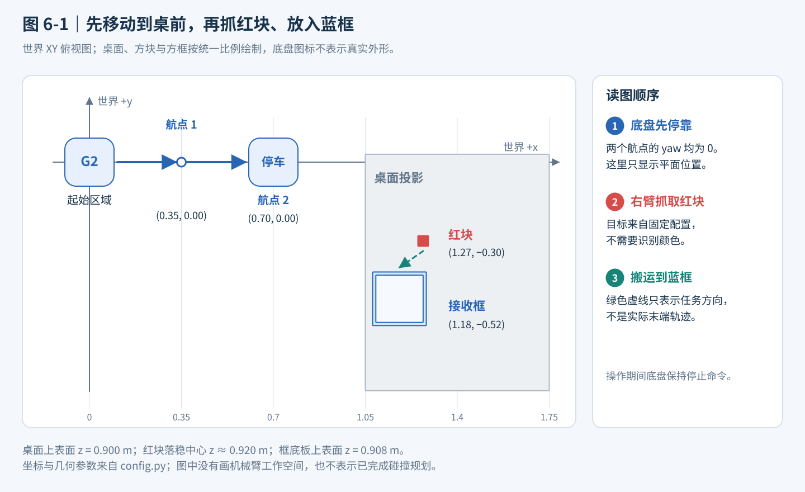
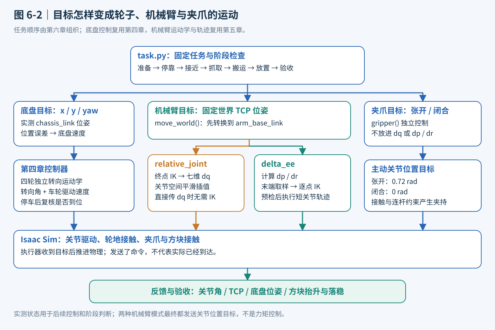
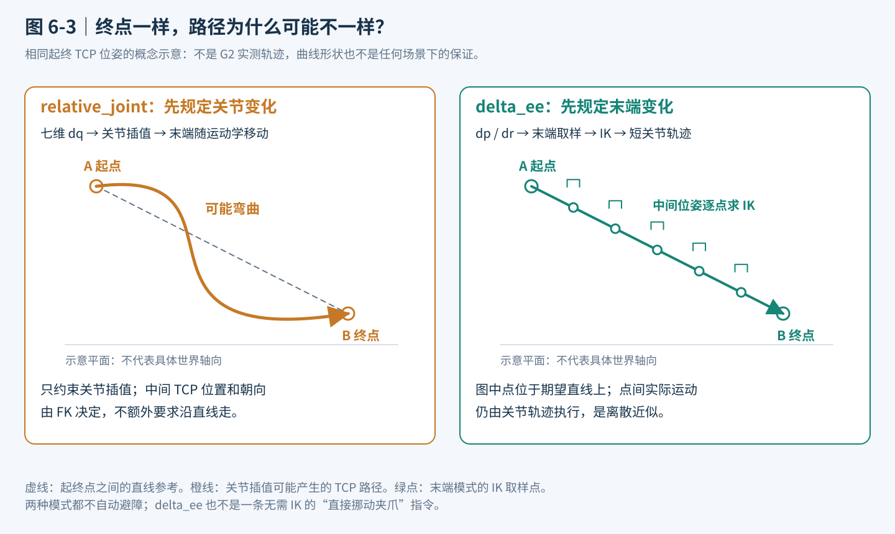
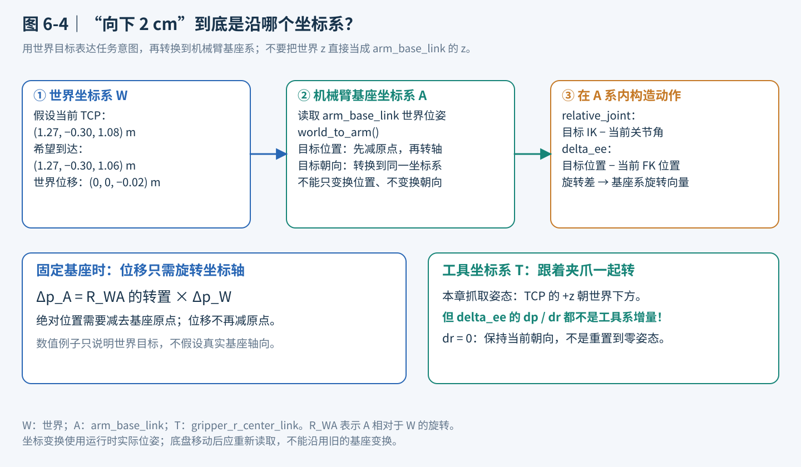
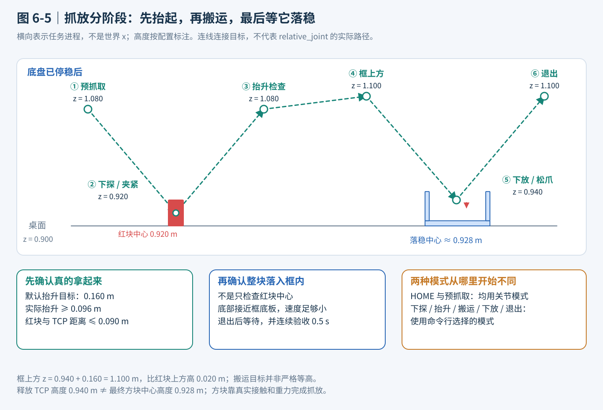

# 第六章 运动控制综合实践：移动与抓取

第四章解决了“怎样让移动底盘按指定速度行驶、到达指定位置”的问题，第五章解决了“怎样让机械臂运动到指定关节姿态或末端位姿”的问题。本章把这两种能力连接起来，完成一个看得见、可以检查结果的任务：**G2 从初始位置移动到桌前，用右臂拿起固定位置的红色方块，再放进固定位置的蓝色方框。**

本章对应的实践代码位于 `code/code_chapter6`，教程位于 `code/chapter6`。**正文前三部分讲系统、控制模式和执行原理，第四部分说明代码与运行基础，第五部分集中提供所有可执行命令和调用示例。** 

开始之前，先明确本章的四个边界：

1. **这是固定场景下的纯控制实践，不是视觉抓取。** 方块坐标、底盘航点和动作顺序由人提前写好，没有相机、检测器、抓取生成网络或语言模型。
2. **“写死目标”不等于“完全没有反馈”。** 底盘读取实际位置，机械臂读取实际关节状态，程序还检查方块是否被抬起。固定的是任务目标，而不是要求机器人闭着眼睛按时间盲动。
3. **移动与操作采用先后执行，而不是同时协调规划。** 底盘先停到桌前，然后机械臂抓放。这不是全身运动规划，也不包含 SLAM、Nav2、MoveIt 或动态避障。
4. **成功必须来自物理接触。** 方块是有质量和重力的刚体，夹爪依靠接触与摩擦把它拿起来。程序不把方块吸附到手上，不通过焊接或瞬移制造成功。

读完本章，应当能够解释三个问题：固定目标如何经过坐标变换变成关节命令，`relative_joint` 与 `delta_ee` 为什么不是同一种动作，以及为什么“机械臂到达了”还不等于“抓取完成了”。

---

## 第一部分 先看完整任务：从两个控制器到一个移动抓放系统

### 1.1 场景里有什么，任务究竟要完成什么

本章只保留理解控制所必需的对象：一台 G2 Omnipicker、物理地面、一张桌子、一块红色立方体，以及一个由底板和四面矮墙组成的蓝色开口方框。没有加载完整仓库背景，也没有随机散落的物体。

把场景做简单，不是为了回避系统问题，而是为了区分问题来源。如果目标位置始终固定，就可以把注意力集中在运动是否正确、坐标是否统一、夹爪是否夹紧，而不是同时排查检测精度和模型推理。

默认任务中的主要尺寸和目标如下。除底盘偏航外，表中坐标和尺寸的单位均为米，使用世界坐标系。

| 对象或目标 | 默认设置 | 这样设置的含义 |
|---|---|---|
| 底盘第一航点 | `(0.35, 0.00, 0.00)` | 先向前移动一段；第三个数是偏航角，不是高度 |
| 底盘最终航点 | `(0.70, 0.00, 0.00)` | 到桌前停靠，偏航保持为零 |
| 桌面中心与尺寸 | 中心 `(1.40, -0.42, 0.86)`，尺寸 `(0.70, 0.90, 0.08)` | 桌面上表面高度是 `0.90` |
| 红块初始中心 | `(1.27, -0.30, 0.921)` | 放稳后中心约为 `z=0.920`，初始留出约 1 mm 间隙 |
| 红块边长、质量 | `0.04`、`0.04 kg` | 4 cm 的小方块，靠接触摩擦抓取 |
| 接收框中心 XY | `(1.18, -0.52)` | 只写平面中心，高度由桌面与底板计算 |
| 接收框内边长、墙高 | `0.18`、`0.045` | 四面矮墙提供明确的“框内”区域 |
| 接收框底板上表面 | `z=0.908` | 桌面高度加 8 mm 底板厚度 |
| 抬升距离 | `0.16` | 拿起后从高处搬运，不沿桌面拖动 |

这些数值集中放在 `config.py` 中。它们组成了一个已经验证过的默认场景，不是所有桌面和机器人姿态都适用的通用参数。



**图 6-1 怎么看：** 先沿蓝色方向读底盘航点，再看桌面的红块和蓝框。绿色虚线只表示“把这个物体搬到那里”的任务关系，不是计算得到的机械臂轨迹。图中位置使用世界坐标，不能直接当成 `delta_ee` 的输入。

### 1.2 整个系统是怎样分工的

可以把这个系统想成“任务安排、动作翻译、执行与检查”三层。

**任务安排层**决定下一步做什么：先移动、再接近、然后夹紧、抬升、搬运和松爪。它不负责计算某个轮子应该转多快，也不直接求解七个关节角。

**动作翻译层**把任务目标翻译成控制器能够接受的输入。底盘目标是平面位置和偏航；机械臂目标是末端的位置与朝向；夹爪目标是主动关节的开合角度。机械臂还要根据所选模式，把目标变成关节增量或末端增量。

**执行与检查层**让 Isaac Sim 中的关节驱动和接触物理推进，同时读取反馈。如果底盘没有停稳、IK 没有收敛、关节没有跟上、方块没有被拿起，就不能继续假装下一步已经具备条件。

| 系统环节 | 输入 | 输出 | 主要实现来源 |
|---|---|---|---|
| 顺序任务 | 固定航点、抓放位姿、执行状态 | 当前阶段和下一段运动目标 | 第六章 `task.py` |
| 底盘位姿控制 | 当前与目标 `x/y/yaw` | 机体坐标下的线速度和角速度 | 第四章 `PoseController` |
| 四轮独立转向控制 | 底盘速度、当前转向角 | 四个转向目标和四个驱动速度 | 第四章运动学与底盘控制器 |
| 机械臂动作适配 | 固定目标或增量动作 | 目标关节角、短段关节轨迹 | 第六章 `MotionController` |
| FK、IK 与关节轨迹 | 当前关节状态、末端目标 | 可执行的关节位置目标 | 第五章控制器与运动学 |
| 接触物理 | 关节目标、碰撞几何、材料和质量 | 实际运动与抓放结果 | Isaac Sim 场景 |
| 结果验收 | 实际 TCP、方块与底盘状态 | 继续执行、失败或成功 | 第六章控制与任务代码 |

这里没有复制一份第九章的控制器。第六章直接导入第四、第五章的模块，只补充把它们连接起来的场景、动作接口和任务逻辑。第九章仅作为本教程组织方式的参考，不是本章的运行依赖。



**图 6-2 怎么看：** 从上往下读：任务给出目标，控制层把目标翻译成关节命令，物理仿真产生实际结果。中间两种机械臂模式是可选支路，不是要先执行一次 `relative_joint` 再执行一次 `delta_ee`；夹爪则有自己独立的命令。最下方的实测状态用于后续控制和任务验收。

### 1.3 为什么固定动作仍然需要闭环

假设给底盘发出“以某个速度前进三秒”的命令。即使速度和时间固定，实际停车点也可能受加速过程、轮地接触、转向滞后和惯性影响。机械臂同样如此：发送目标关节角，只代表“要求到那里”，不代表物理关节已经到那里。

因此本章使用的是**固定目标、反馈执行**：

- 底盘反复计算“目标位置减去实际位置”，离目标越近，速度越小。
- 机械臂从当前实测关节状态出发，生成并执行轨迹。
- 抓取后读取方块状态，确认不是空夹。
- 放置后读取方块状态，确认不是只在空中经过目标。

程序使用仿真状态作为理想化反馈来源。真实机器人要靠编码器、定位系统和传感器提供这些信息；本章不实现这一部分传感器链路。

还要区分两种“已知”：**目标是已知的，不代表执行结果也是已知的。** 红块的目标位置来自配置，是否拿起来却必须通过实际结果检查。这样才能把一个动作脚本变成可验证的控制实验。

---

## 第二部分 两种机械臂动作模式：关节增量与末端增量到底有什么不同

### 2.1 先把名称、动作维度和直观含义说清楚

本章使用的规范名称是 **relative joint space（相对关节空间）** 和 **delta end-effector pose（末端位姿增量）**。程序中的模式名称分别为 `relative_joint` 和 `delta_ee`，命令行必须使用这两个拼写。

先用手臂做一个类比。

“肩关节再转一点、肘关节再弯一点”是在描述**关节应该怎样变化**；“保持手掌朝向，让手向桌面靠近两厘米”是在描述**手应该怎样变化**。前者接近关节增量，后者接近末端增量。

| 比较项目 | `relative_joint` | `delta_ee` |
|---|---|---|
| 动作直接描述什么 | 七个关节各自改变多少角度 | 末端平移多少、旋转多少 |
| 动作形式 | 七维向量 `dq` | 三维平移 `dp` 加三维旋转向量 `dr` |
| 单位 | rad | m 与 rad |
| “相对”的参考 | 调用时的实测关节角 | 调用时由实测关节角计算的末端位姿 |
| 直接使用该接口时是否需要 IK | 不需要 | 需要 |
| 本章固定世界目标如何接入 | 先 IK 求关节目标，再转成 `dq` | 转为机械臂基座目标，再求 `dp/dr` |
| 中间路径 | 在关节空间平滑插值 | 在末端空间取中间位姿，再逐点 IK |
| TCP 路径特点 | 通常不是直线 | 离散近似直线；小段间仍由关节轨迹执行 |
| 最后发给仿真的是什么 | 关节位置目标 | 仍然是关节位置目标 |

**关键区别不在最后调用了哪个关节执行器，而在“动作表达在哪个空间，以及中间路径怎样生成”。** 两种模式都不是力矩控制，也不是仅凭名称就能得到的柔顺或阻抗控制。



**图 6-3 怎么看：** 左图先决定关节如何变化，TCP 路径由机械臂运动学产生；右图先规定中间 TCP 位姿，再求出相应关节角。右图的小夹爪符号表示这个例子要求保持朝向。两幅图都是概念示意，没有拿示意曲线冒充真实 G2 运行轨迹。

### 2.2 相对关节空间：从当前关节角再走一段

设当前七个关节的角度为 $q_{\mathrm{measured}}$，输入的七维增量为 $\Delta q$，则本次动作的目标是：

$$
q_{\mathrm{goal}}=q_{\mathrm{measured}}+\Delta q
$$

例如，第一关节当前为 `0.20 rad`，本次增量为 `0.05 rad`，目标就是 `0.25 rad`。下一次再调用相同增量时，参考的是**下一次调用时重新读取的实际状态**，不是固定参考点，也不是一直相对于初始 HOME 姿态。

**七个数字分别对应哪个关节？** 本章控制的是右臂，顺序沿用第五章的 `ARM_JOINT_NAMES["right"]`，不是随意选取机器人全部自由度中的前七个：

| 输入位置 | 右臂关节名称 | 含义 |
|---|---|---|
| 第 1 个 | `idx61_arm_r_joint1` | J1 的角度增量 |
| 第 2 个 | `idx62_arm_r_joint2` | J2 的角度增量 |
| 第 3 个 | `idx63_arm_r_joint3` | J3 的角度增量 |
| 第 4 个 | `idx64_arm_r_joint4` | J4 的角度增量 |
| 第 5 个 | `idx65_arm_r_joint5` | J5 的角度增量 |
| 第 6 个 | `idx66_arm_r_joint6` | J6 的角度增量 |
| 第 7 个 | `idx67_arm_r_joint7` | J7 的角度增量 |

正负号表示沿各关节自身定义的轴正转或反转，不能统一理解为“手向左或向右”。某一项为零，只表示该关节本次目标角度不变；其他关节运动时，TCP 仍然可能移动。夹爪开合不在这七个数中，而由独立的 `gripper()` 接口控制。

用一组便于手算的数说明。假设调用时实际角度恰好为：

$$
q_{\mathrm{measured}}=[0,-0.35,0,-1.10,0,0.35,0]
$$

输入增量为：

$$
\Delta q=[0.05,0,-0.02,0,0,0.03,0]
$$

那么目标就是：

$$
q_{\mathrm{goal}}=[0.05,-0.35,-0.02,-1.10,0,0.38,0]
$$

所有数字均为弧度；`0.05 rad` 约为 `2.86°`，不是 `0.05°`。这组数字只用于解释加法，不能据此判断末端是否避开了桌子。关节目标不越界，也不代表中间路径一定没有碰撞。

这和绝对关节命令不同。绝对命令“去 `0.25 rad`”重复执行，目标仍是 `0.25 rad`；相对命令“再增加 `0.05 rad`”重复执行，会继续累加。把绝对关节角误当作增量，是接入后续策略时很常见的错误。

本章的任务目标是固定的世界末端位姿，而不是人工手写每一段七关节角。因此任务调用该模式时，存在一层适配：

**固定世界位姿 → 转到机械臂基座坐标系 → 第五章 IK → 目标关节角 → 减去当前关节角 → 执行关节增量。**

所以，需要同时理解两句话：

- `relative_joint()` 这个低层接口本身不需要 IK。
- 本章通过 `move_world()` 执行固定抓放位姿时，会先用 IK 构造该接口需要的增量。

得到目标关节角后，轨迹沿用第五章的三次时间缩放。将归一化时间记为 $\tau=t/T$，则：

$$
s(\tau)=3\tau^2-2\tau^3,\qquad
q(\tau)=q_0+s(\tau)(q_1-q_0)
$$

直观上，它让关节从静止平滑启动，再平滑停到目标，而不是一下把整个角度差作为阶跃命令发给关节。第五章生成器还会按关节位移和速度限制延长过短的时间，但这不等于工业级加速度、jerk 和碰撞约束规划。

**例子一：J1“再转 0.05 rad”，这一秒中到底发生什么？**

为了看清一条指令的含义，暂时只看 J1：假设它当前实测为 `0.20 rad`，其余关节的增量都为零，请求动作时间为 `1 s`。目标角就是 `0.25 rad`。不考虑限速延长，用上面的时间缩放计算，可得到：

| 轨迹时间 | 时间比例 $\tau$ | 进度 $s(\tau)$ | 此时下发的 J1 目标角 |
|---|---:|---:|---:|
| 起点参考 | 0 | 0 | `0.2000000 rad` |
| `0.25 s` | 0.25 | 0.15625 | `0.2078125 rad` |
| `0.50 s` | 0.50 | 0.5 | `0.2250000 rad` |
| `0.75 s` | 0.75 | 0.84375 | `0.2421875 rad` |
| 轨迹终点 | 1 | 1 | `0.2500000 rad` |

这是公式上的目标采样示例，不是实测记录；实现中的物理步取样未必恰好落在表中每个时刻。表格也不表示“末端走了全程的同样比例”，因为关节角与末端位置不是简单的线性关系。

再假设执行后实测 J1 为 `0.247 rad`，而不是恰好 `0.250 rad`。此时再调用一次相同的 `+0.05 rad`，新目标是 `0.297 rad`，不是 `0.300 rad`。**下一次的起点看实际反馈，不看上一次希望达到哪里。** 如果想准确回到最初的关节姿态，应保存原来的关节向量，并用“原来角度减当前实测角度”重新构造增量；简单把原始增量取负，只能近似撤销上一次动作。

结合 `control.py`，一次 `relative_joint()` 调用可以按以下顺序理解：

1. 检查输入必须是七个有限数，不能混入 `NaN`，也不能少写一个关节。
2. 读取实际关节角，加上增量，并检查目标是否超出关节限位。越界时报错，不把动作偷偷截短。
3. 检查动作时间为有限正数；没有指定时使用 `arm_duration`，默认 `2.5 s`。
4. 调用第五章的 `make_trajectory()`，逐个物理步发送**绝对关节位置目标**。高层输入是相对增量，不代表底层驱动也接收增量。
5. 轨迹结束后继续推进 `0.3 s`，检查七个关节中最大的实际跟踪误差是否超过 `0.06 rad`，通过后返回实际关节角。

因此，这是一个“调用后执行完这一段才返回”的接口，不是每帧都要重复发送一次的速度指令。`duration=1.0` 表示请求用约一秒完成这一段，不是让关节以每秒一个增量永远运动；限速延长与末尾等待还会增加实际耗时。

要注意，**关节平滑不等于末端走直线**。即使七个关节都按同一个时间比例变化，末端也可能画出一条弧线。`task.py` 中“下探”“抬升”描述的是目标方向，在关节模式下不能把它们理解为严格的竖直直线轨迹。

### 2.3 末端增量：先规定手怎么走，再求关节怎么配合

末端也叫 end effector，简称 EE。本章使用 `gripper_r_center_link` 作为右夹爪的 TCP，即工具中心参考点。这个点的位置与朝向共同构成末端位姿。

`delta_ee` 输入两部分：

- $\Delta p$：三个平移分量。
- $\Delta r$：三个旋转向量分量。方向表示旋转轴，向量长度表示旋转角，单位为弧度。

例如，`dp=[0.02, 0, 0]` 表示沿机械臂基座 x 轴移动 2 cm；`dp=[0, 0, 0]` 表示本次不改变目标位置。这里的 `0.02` 是米，不是毫米，也不是速度。三个平移数字不包含夹爪开合信息。

旋转输入可以先从单轴例子理解：`dr=[0, 0, 0.10]` 表示绕机械臂基座 z 轴旋转 `0.10 rad`，约 `5.73°`。若 `dr=[0.03, 0.04, 0]`，则旋转角是向量长度 `0.05 rad`，旋转轴方向是 `[0.6, 0.8, 0]`，不是“先绕 x 转一次，再绕 y 转一次”。这只说明旋转表示法，并不保证当前姿态下这样的目标必然可达。

**旋转向量不是三个可以直接相加的欧拉角，也不是四元数。** 小转角时它很直观，但组合旋转仍然必须按旋转矩阵处理。

本章约定平移和旋转轴均表达在 `arm_base_link` 坐标系，而不是当前夹爪的局部坐标系。于是：

$$
p_{\mathrm{goal}}=p_0+\Delta p
$$

$$
R_{\mathrm{goal}}=\operatorname{Exp}(\widehat{\Delta r})R_0
$$

这里的 $\operatorname{Exp}(\widehat{\Delta r})$ 表示由旋转向量得到的旋转矩阵。公式中左乘当前姿态，是为了表达“绕机械臂基座坐标系中的轴旋转”。如果改成右乘，就改变了旋转的参考坐标系，不能随意交换。

不熟悉矩阵指数也没有关系，可以先记住三个操作规则：**平移写米，旋转写弧度，增量方向看机械臂基座坐标系。** `dr` 全为零表示保持当前朝向，不是把夹爪姿态恢复成某个“零姿态”。

执行时并不是只对最终末端目标做一次 IK。本章先在起点和终点之间取一串位姿：

$$
p(\alpha)=p_0+\alpha\Delta p,\qquad
R(\alpha)=\operatorname{Exp}(\alpha\widehat{\Delta r})R_0,
\quad 0\leq\alpha\leq1
$$

分段数量由平移和旋转共同决定，默认每段名义平移不超过约 `12 mm`、旋转不超过约 `0.08 rad`。每个中间位姿用第五章的 IK 求解，并把上一点的解作为下一点的初值，尽量保持解的连续性。

把分段规则写成公式更容易核对实现。记段数为 $N$，默认参数下：

$$
N=\max\left(1,\left\lceil\frac{\|\Delta p\|}{0.012}\right\rceil,\left\lceil\frac{\|\Delta r\|}{0.08}\right\rceil\right)
$$

其中 $\lceil\cdot\rceil$ 表示向上取整。例如平移 `0.06 m`、不旋转，就分成 5 段；每个中间点都保持原来的末端朝向，位置沿期望方向增加约 `0.012 m`。若同时旋转 `0.48 rad`，旋转约束要求 6 段，便按 6 段同时插值位置与姿态。这里按平移向量的总长度分段，不是分别对 x、y、z 各执行一遍。

从代码角度看，一次 `delta_ee()` 调用包含以下步骤：

1. 检查 `dp`、`dr` 各有三个有限数，通过实际关节角做 FK，取得当前末端位置与旋转。
2. 计算段数，为每个中间位置和朝向调用第五章 IK。第一点以当前关节状态为初值，后续点以上一点的解为初值。
3. 检查每个 IK 是否成功、关节解是否越界，并保存本段全部中间关节目标。这里是在内存里预检，还没有执行机械臂动作。
4. 检查请求时间；默认总时间为 `2.5 s`。将请求时间按段数分配，再为每一小段生成并执行关节轨迹；单段仍可能因为关节限速而延长。
5. 执行后等待 `0.3 s`，检查末段目标的关节跟踪误差，再返回 FK 末端位姿。

七关节机械臂完成六维末端目标时，通常不只有一种关节配置。沿用上一个解作为下一次初值有助于解的连续性，但并不等于实现了全局最优姿态选择、奇异点自动规避或碰撞规划。如果中间点求解失败，应先检查坐标、目标、姿态和路径，而不是直接跳过该点。

**整段的中间 IK 都成功，程序才开始下发动作。** 如果走到第十个预检点发现不可达，就在本段执行前报错，而不是先走九步再卡住。这里预检的是当前这一段，不是一次性保证整个任务都可达，也没有做整条机械臂碰撞检查。

执行阶段仍通过第五章生成短关节轨迹。因此更准确的描述是“末端直线的离散近似”，而不是连续时间中精确的笛卡尔直线。小段之间会有减速和启动，不应把这个简单教学实现称为具有全局连续速度约束的高级笛卡尔规划器。

**例子二：让夹爪在基座系里“前进 3 cm、侧移 −2 cm、再移 1 cm”。**

假设 FK 读到当前末端位置为 $p_0=(0.40,0.10,0.20)$，位置单位是米，坐标表达在 `arm_base_link` 中。现在输入：

$$
\Delta p=(0.03,-0.02,0.01),\qquad \Delta r=(0,0,0)
$$

目标位置便是 $p_1=(0.43,0.08,0.21)$，目标朝向与本次调用起点相同。这里的数字仅用于解释算法，不是已经验证可达的 G2 抓取点，不能当作默认任务坐标直接使用。

平移总长度为：

$$
\|\Delta p\|=\sqrt{0.03^2+(-0.02)^2+0.01^2}\approx0.03742\;\mathrm{m}
$$

按默认每段 `0.012 m` 的规则，向上取整得到 4 段。于是先生成下表中的位姿，再为每一行求 IK：

| 取样点 | $\alpha$ | 基座系中的末端目标位置（m） | 末端朝向 |
|---|---:|---|---|
| 第 1 点 | 0.25 | `(0.4075, 0.0950, 0.2025)` | 与起点相同 |
| 第 2 点 | 0.50 | `(0.4150, 0.0900, 0.2050)` | 与起点相同 |
| 第 3 点 | 0.75 | `(0.4225, 0.0850, 0.2075)` | 与起点相同 |
| 第 4 点 | 1.00 | `(0.4300, 0.0800, 0.2100)` | 与起点相同 |

每一小段的平移长度约为 `9.35 mm`。若请求时间为 `2 s`，每小段先分配 `0.5 s`，再由第五章轨迹生成器检查是否需要延长。**必须四个 IK 都成功，才开始执行第一个小段。** 假如第三点不可达，这一次 `delta_ee()` 调用会在开始下发轨迹前失败，不会先移动到第二点再让机器人悬在那里。

这里没有人手工填写七个关节的增量，IK 会为每个末端目标求出相应关节角。`dr=0` 也不表示手腕关节都不动：为了在平移时维持夹爪朝向，多个关节可能需要一起调整。

### 2.4 为什么坐标系和准备动作必须一起理解

世界坐标系适合摆放桌子、方块和接收框；机械臂运动学却是在 `arm_base_link` 下建立的。底盘移动以后，这两个坐标系之间的相对位置会改变。世界中同一个红块，在移动前后相对于机械臂的位置当然不同。

设机械臂基座在世界中的位置和旋转分别为 ${}^{W}p_A$、${}^{W}R_A$，目标 TCP 的世界位姿为 ${}^{W}p_T$、${}^{W}R_T$，转换到机械臂基座坐标系是：

$$
{}^{A}p_T=({}^{W}R_A)^T({}^{W}p_T-{}^{W}p_A)
$$

$$
{}^{A}R_T=({}^{W}R_A)^T{}^{W}R_T
$$

可以把它理解成：先减去机械臂基座的位置，把原点搬过去；再旋转坐标轴，让目标用机械臂的方向来描述。`environment.py` 的 `world_to_arm()` 就负责这一步。

本模型的 `arm_base_link` 轴向并不能直接当作世界轴向使用。**世界向上移动两厘米，不应不加转换地写成 `delta_ee` 的第三个分量增加 `0.02`。** 想在世界中上下移动时，先构造世界目标，再通过 `move_world()` 转换最清楚。第五部分给出对应调用示例。



**图 6-4 怎么看：** 世界坐标用于描述“到桌上哪个点”，基座坐标用于计算机械臂运动学，工具坐标跟随夹爪旋转。图中不假设基座轴恰好和世界轴平行，实际转换必须读取运行时位姿。

**同一个“向下 2 cm”，两种模式实际做了什么？** 假设底盘已经停稳，夹爪位于红块上方，希望保持世界朝向并降低 TCP 高度。先在世界中把目标写成当前 TCP 位置加 `[0, 0, -0.02]`，然后交给 `move_world()`：

| 执行环节 | 选择 `relative_joint` | 选择 `delta_ee` |
|---|---|---|
| 世界目标转换 | 将目标位置、朝向转到机械臂基座系 | 相同 |
| 构造动作 | 对终点求 IK，计算目标关节角减当前角度 | 计算基座系中的位置差与旋转差 |
| 中间路径 | 在起终关节角之间插值 | 在起终末端位姿之间取样，逐点求 IK |
| 下探过程中保持朝向 | 终点有朝向要求，中间朝向没有额外约束 | 每个取样位姿都带有朝向要求，但执行仍存在离散与跟踪误差 |
| 末端经过哪里 | 通常弯曲，不能只根据终点判断途中净空 | 更接近期望的下探直线，也不自动避开障碍 |
| 到位后检查 | 检查实际世界 TCP 位置和朝向 | 相同 |

在 `move_world()` 的末端增量分支中，平移差为 $\Delta p=p_{\mathrm{target}}-p_{\mathrm{current}}$；旋转差由 `orientation_error()` 根据目标旋转与当前旋转计算，不是将两个欧拉角数组直接相减。若目标朝向与当前实际朝向之间存在微小误差，计算出的 `dr` 也可能非零，因此“任务期望保持向下”并不代表每次实际传入的 `dr` 都严格为零。

**例子三：把这个区别放回红块抓取任务。** 假设预抓取已经理想到位，TCP 世界位置为 `(1.27, -0.30, 1.08)`，朝向也已调整为向下。现在只做一个高处练习：保持朝向，降低 `2 cm`，到 `(1.27, -0.30, 1.06)`，还不接触红块。

- **关节模式**：对终点位姿做 IK，得到七个目标角，再减去当前七个实际角度。执行时沿关节空间插值。我们知道终点应低 `2 cm`，但中途是否偏向侧面、朝向是否有变化，必须通过 FK 或实际状态检查，不能只看终点就断言路径是竖直的。
- **末端模式**：先把这段世界位移转换为基座系位移。理想状态下旋转差为零，平移长度仍为 `0.02 m`，所以会分成两段，中间世界目标对应 `z=1.07` 和 `z=1.06`。在每个点上都要求保持指定朝向，再分别求 IK；点间由短关节轨迹执行。

实际运行时会有起点和朝向误差，段数以当次计算为准。两段取样的说明基于上面的理想起点，不是保证每次运行日志都恰好产生两个点。第五部分的独立接口示例可分别选择这两种模式来做此练习，每轮重新创建环境，避免把不同起点的结果拿来直接比较。

完整默认任务不是只下探 `2 cm`，而是从 `z=1.08` 下探到 `z=0.92`，共 `16 cm`。若起点理想到位且不需要旋转修正，末端模式会预检 $\lceil0.16/0.012\rceil=14$ 段；关节模式则对该阶段终点求 IK，再生成一段关节空间轨迹。这正是两种模式在同一个抓取任务中的实际区别。

**如何选择？** 已经知道一组关节姿态、想收臂或进行关节教学时，`relative_joint` 更直接；希望表达接近、下探、抬升等末端运动意图时，`delta_ee` 更直观，但需要求解多个中间 IK。本章保留两种模式，是让读者比较“同一个终点，采用不同的路径生成方式”，不是宣称某一种模式对所有任务都更好。

还要分清“重复增量”和“重复目标”：直接重复 `relative_joint(dq)` 或 `delta_ee(dp, dr)`，会从新的状态继续增加动作；重复 `move_world()` 的同一个固定世界目标，则会重新计算剩余误差，不是要求机械臂沿原来的方向再走同样远。

另外，选择 `--mode delta_ee` 并不意味着启动后的每一瞬间都必须走末端直线。当前任务中，两种模式都先用关节轨迹完成 HOME 准备和向下预抓取姿态，然后才在下探、抬升、搬运、下放和退出阶段按所选模式执行。

原因是：**起点和终点分别可达，不代表把它们用末端直线连起来之后，每个中间姿态也可达。** 初始机械臂朝向与向下抓取朝向相差较大，强行用一条同时平移、旋转的直线进入桌面区域，反而可能遇到不可达点。这里是明确设计的分阶段动作，不是 IK 失败后偷偷切换模式。

---

## 第三部分 把动作真正执行出来：底盘停靠、接触抓取与结果验收

### 3.1 底盘怎样到达固定点，又为什么不能读错机器人根坐标

底盘目标用三个数描述：平面横坐标、纵坐标和偏航角。第四章的 `PoseController` 计算世界平面位置误差，再根据当前偏航把误差转换到机体坐标系，输出前后速度、左右速度和转动速度。

如果位置误差的机体分量为 $e_x^B,e_y^B$，偏航误差为 $e_\psi$，可以直观理解为：

$$
v_x\propto e_x^B,\qquad v_y\propto e_y^B,\qquad \omega_z\propto e_\psi
$$

随后由第四章的四轮独立转向运动学计算车轮转向角和驱动速度，再经过限速、加速度约束和指令超时保护。第六章不使用差速底盘公式替代 G2 的实际四轮转向结构。

本章的位姿控制器把最大平移速度设置为 `0.22 m/s`、最大偏航速度设置为 `0.30 rad/s`，到达容差为 `6 mm` 和 `0.012 rad`。每个航点有控制循环上限；停止后额外等待 `0.5 s` 再复核，以免刚经过容差区域就把“路过目标”误判为“已经停好”。配置的 `25 s` 用于限制航点控制循环次数，并不是严格的墙钟计时器，停车复核的等待还会推进仿真。

这里有一个重要的模型细节：**G2 的 articulation 根位姿不能直接视为底盘位姿。** 本模型根位姿位于躯干一侧的运动链参考位置，若直接用 `robot.get_world_pose()` 作为底盘坐标，原点和轴向可能都不符合平面导航的要求。

第六章明确读取 `/genie/chassis_link` 作为底盘参考，读取 `/genie/arm_base_link` 做机械臂坐标变换。把这两个用途分开，比为了“代码少一行”而混用机器人根坐标更重要。

### 3.2 从预抓取到松爪：动作顺序为什么这样安排

底盘停好后，任务执行下列阶段。它是清楚的顺序程序，不需要复杂任务规划器。

| 阶段 | 做什么 | 不能省略的原因 |
|---|---|---|
| 准备 | 右臂到 HOME，夹爪张开 | 让抓放从可解释的起始状态开始 |
| 移动 | 按两个固定航点停到桌前 | 让抓放区域进入机械臂工作空间 |
| 预抓取 | 到红块上方，夹爪调整为向下 | 把朝向调整和接触动作分开 |
| 下探 | TCP 到固定抓取高度 | 让两指进入能够夹住方块的位置 |
| 夹紧 | 关闭主动夹爪关节并等待 | 给驱动与接触物理建立夹持的时间 |
| 抬升 | 抬到红块上方的安全高度 | 验证抓取，同时离开桌面 |
| 搬运 | 从高处移动到框上方 | 减少拖桌面和碰框墙的风险 |
| 下放 | 移动到固定释放位姿 | 降低松爪时方块掉落的高度 |
| 释放、退出 | 松开夹爪，随后向上离开 | 避免夹爪继续影响方块落稳 |
| 验收 | 等待并检查方块状态 | 排除空抓、掉落和框外放置 |

抓取目标高度不是初始生成高度 `0.921`，而是按桌面上表面加半个方块边长计算，即 `0.920`。初始的小间隙是为了生成刚体，真正抓取时以落在桌面上的几何高度为目标。

放置目标是框底板高度，加方块半高，再留 `12 mm` 的释放间隙。对应 TCP 高度约为 `0.940`，释放后方块靠重力落到底板上，稳定中心高度约为 `0.928`。**释放位姿和最终静止位置不是同一个量。**

抓放姿态用完整旋转矩阵固定，夹爪 TCP 的 z 轴朝世界下方，x 轴沿世界 y 方向。这样不只是“手到了方块中心”，还保证夹爪以正确朝向接近。仅约束位置的 IK 可能把手腕翻到不适合夹取的姿态，因此本任务使用同时约束位置与朝向的 IK。



**图 6-5 怎么看：** 横向是任务进程，不是机器人向某个世界方向一直移动。红块上方目标高度是 `1.080 m`，框上方目标高度是 `1.100 m`，所以“高空搬运”并非严格水平等高。虚线仅连接阶段目标，不把关节模式的实际路径假定为直线。框中的最终高度标注属于**落稳后的红块中心**，其余阶段标注的是 **TCP 目标**，两者不要混为一谈。

### 3.3 夹爪为什么不是一条“开关指令”那么简单

在任务层，夹爪只有“张开”和“闭合”两个动作；但物理层仍是关节驱动、连杆约束、碰撞网格和摩擦共同起作用。

本模型右夹爪的主动关节名是 `idx81_gripper_r_outer_joint1`。第六章只向这个主动关节发送位置目标，其余夹爪连杆由原资产中的 mimic 与机械约束带动。默认张开目标为 `0.72 rad`，闭合目标为 `0 rad`。

不要把“角度越大”想当然地理解为“夹得越紧”。开合方向由模型定义决定，本章已经按原始资产确认。也不要要求抓住方块以后实际角度必须到达零：方块挡在两指之间，实际角度停在中间位置往往正是接触结果。

场景沿用原夹爪碰撞网格，并在本次运行中设置接触材料和较高的关节求解迭代精度。方块质量为 `0.04 kg`，材料设置静摩擦系数 `1.2`、动摩擦系数 `1.0`、恢复系数 `0`。这些是默认教学场景的物理参数，不是通过把方块固定到夹爪上来绕过抓取。

本章没有新增一个外部 PID 力矩环。第五章控制器发送位置目标，模型中的关节驱动负责底层跟踪；再叠加一套未经设计的力矩控制，不仅不能自动提高抓取质量，还会混淆本章要学习的控制层次。

### 3.4 怎样判断是真成功，而不是“脚本跑到了最后”

一次可靠的演示必须能说明失败发生在哪里。本章把检查安排在运动和接触的关键边界，而不是只在结尾打印一句“完成”。

| 检查项 | 当前实现的判定 | 主要防止的问题 |
|---|---|---|
| 参数与动作合法性 | 维度正确、数值有限、关节目标不越界 | NaN、动作维度错误、静默裁剪 |
| IK | 求解器报告收敛；末端模式预检本段全部中间点 | 向不可达位姿运动 |
| 关节跟踪 | 最大关节角误差不超过 `0.06 rad` | 已发指令但关节没跟上 |
| TCP 到位 | 位置误差不超过 `12 mm`，姿态误差不超过 `0.06 rad` | 坐标系错了却仍报告到达 |
| 抬升检查 | 至少升高计划抬升量的 60%，且方块中心距 TCP 不超过 `9 cm` | 空夹或已经掉落 |
| 放置检查 | 整块方块位于框内，底部接近底板，线速度不超过 `0.04 m/s` | 方块中心在框内但边角越界，或仍在下落 |
| 连续稳定检查 | 满足放置条件并连续观察约半秒 | 只在一个瞬间经过目标 |
| 底盘漂移 | 抓放期间平面位置变化不超过 `2 cm` | 底盘慢慢滑走却仍声称固定基座操作成功 |

入框检查不是只看方块中心。程序根据方块旋转计算它在世界坐标轴方向上的包围盒半尺寸，再判断整个 XY 范围是否位于框内，并保留 `2 mm` 边界余量。方块底部高度需要在底板上表面的 `6 mm` 容差内。

这些检查也有边界。抬升条件是一个简洁的“已拿起且仍靠近手”的判据，不是力闭合分析；放稳条件检查了位置和线速度，但没有完整接触力分析；底盘漂移验收只检查平面平移，不等于六维基座稳定性认证。

当前程序没有自动重抓或故障恢复。出现异常后，它会停止底盘、记录失败原因并关闭仿真。对本章来说，**清楚地报告失败，比用不透明的补救动作把演示勉强继续下去更有教学价值。**

---

## 第四部分 理解代码组织和运行基础：只准备本章真正需要的东西

### 4.1 教程、代码和资产分别放在哪里

项目根目录是 `/home/robot/g2_robot`。它下面的 `code/chapter6` 保存本教程，`code/code_chapter6` 保存可执行程序，`assets/robot/G2_omnipicker` 保存共享机器人资产。

| 文件 | 主要职责 | 阅读时关注什么 |
|---|---|---|
| `config.py` | 定义固定场景和任务参数 | 哪些值改变任务，哪些值改变控制节奏 |
| `environment.py` | 启动仿真，创建场景，读取底盘与 TCP | 世界、机械臂基座和底盘坐标怎么区分 |
| `control.py` | 复用第四、第五章，提供增量动作和夹爪接口 | 目标如何逐层变成实际关节命令 |
| `task.py` | 按阶段组织移动抓放与验收 | 为什么必须按这个顺序执行 |
| `recording.py` | 可选的流式 JSONL 采集 | 记录的是哪些状态、哪些命令 |
| `demo_pick_place.py` | 参数解析、资源创建、运行与清理 | 如何启动、失败如何退出 |
| `README.md` | 快速运行和接口说明 | 查命令、参数和历史验证记录 |

建议按 `config.py → task.py → control.py → environment.py → recording.py` 阅读。先知道场景和任务，再看控制细节，比从仿真初始化开始逐行读更容易建立整体理解。

发布或迁移本章时，不能只复制 `code_chapter6`。第四、第五章的模块以及机器人 USD 引用的子资产也需要保留。这里是为了沿用前面章节的代码，而不是把第六章做成完全独立的第三方安装包。

启动脚本通过自身位置找到 `code` 目录，使不同章节按包名导入，避免多个 `config.py` 同名冲突。资产路径也由模块位置推导，而不是依赖启动时的当前目录。**但 Python 必须先找到入口脚本，才能运行这段路径处理逻辑。** 这正是“脚本支持任意目录启动”和“随便写相对路径也能找到脚本”之间的区别。

### 4.2 环境与依赖：现有机器不要重复安装一套仿真器

本章已有物理验证使用的是 **Isaac Sim 5.1**，并采用安装目录中的 `python.sh` 启动。这是复现基线，不代表 5.1 是最新版本。安装前请自行查看对应版本的官方支持状态；如升级到其他版本，需要重新验证 API、资产加载和抓放行为，不能直接沿用本章的成功记录。[参考 1]

本教程采用“工作站安装 + 仿真器内置 Python”一条主路径，不同时展开 Docker、源码编译和多种 Conda 环境。当前安装的 `python.sh` 指向内置 Python 3.11，并设置仿真扩展需要的环境。运行方式可对照官方 Python 环境说明。[参考 2、3]

| 依赖层级 | 本章需要什么 | 准备方式 |
|---|---|---|
| 硬件与驱动 | 满足所选 Isaac Sim 版本要求的 NVIDIA GPU 与驱动 | 按对应版本的官方要求检查，必要时运行兼容性检查器 |
| 仿真运行时 | Isaac Sim、Kit、PhysX、USD、`isaacsim.core` 等 | 使用完整 Isaac Sim 安装，不逐个从 pip 拼装底层模块 |
| Python 数值计算 | NumPy | 优先使用仿真器配套版本，先检查再考虑修复 |
| Python 标准库 | `argparse`、`json`、`pathlib`、`unittest` 等 | 不需要单独安装 |
| 项目模块 | `code_chapter4`、`code_chapter5`、`code_chapter6` | 保留当前目录结构 |
| 本地资产 | 原始 G2 USD 和它引用的配置、几何、材质文件 | 保留完整共享资产与引用关系 |

本章沿用前面安装教程准备的环境。若第四、第五章能够运行，可直接进入第五部分运行本章任务，无需重新安装 Isaac Sim，也没有额外的训练依赖要装。

`--headless` 只是关闭窗口显示，不代表本教程支持没有兼容 GPU 的纯 CPU 运行。GPU、驱动、显示与资源要求应按所用版本的官方说明和兼容性检查结果判断，不把“能运行普通 NumPy”当作“能运行完整 Isaac Sim”。[参考 1、4]

### 4.3 环境加载与仿真时间，为什么会影响控制理解

`environment.py` 先创建 `SimulationApp`，再导入需要应用扩展的 Isaac Sim 核心模块。这与官方独立 Python 脚本的初始化顺序一致。[参考 2、3] 随后创建物理世界、地面、灯光、G2、桌面和方框，初始化机器人与方块句柄，再推进一段预热时间。

默认物理频率为 `120 Hz`，即一个物理步约 `8.33 ms`。渲染时间步单独设置为 `1/60 s`；无窗口运行时不绘制每一步画面。任务中的等待和轨迹通过推进物理步实现，而不是简单调用系统睡眠来假装机器人已经运动。

要区分三种时间：

- **轨迹参数时间**：例如一段机械臂动作的默认 `2.5 s`，生成器可能因为关节位移而延长。
- **仿真时间**：推进的物理步数乘以时间步，包括等待和稳定检查。
- **实际运行耗时**：从终端启动到退出的真实时间，还包括应用启动、资产加载和计算。

程序报告的 `simulation_time_s` 是仿真时间，不是实际耗时。末端增量模式还包含分段求解、分段执行和等待，不能要求整个程序在一段配置时长内完成。

图形窗口中可以观察动作，但本例不支持在任务执行中随意暂停、停止或重置后继续沿用旧控制状态。环境检测到停止或暂停会报错退出；需要重新运行一次任务。

### 4.4 采集数据是为了分析控制，不是默认开始训练模型

可选记录器大约每 `20 Hz` 写一行 JSON。相对于 120 Hz 的物理循环，它是一份下采样的控制观察记录，并不是逐物理步完整保存仿真。

| 字段 | 含义 | 容易产生的误解 |
|---|---|---|
| `time`、`phase` | 仿真时间与任务阶段 | 不是终端墙钟时间 |
| `base_pose` | 实际底盘 `x/y/yaw` | 第三个数不是 z 高度 |
| `base_command` | 限速后的 `vx/vy/wz` 命令 | 不是实际测量速度 |
| `arm_position` | 实际七关节角 | 是状态，不是本次增量 |
| `arm_target` | 该时刻已下发的七关节绝对目标 | 不是 `dq`，也不是 `delta_ee` |
| `gripper_position/target` | 夹爪实际与目标角 | 夹住物体后两者可以不相等 |
| `tcp_world` | TCP 世界位置 | 当前记录没有保存完整 TCP 朝向 |
| `cube_world/quaternion` | 方块世界位置与姿态 | 真值用于验收和分析，不是视觉检测输出 |
| 最后一个 `result` | 成功指标或失败原因 | 应检查这一行，而不是只数动作阶段 |

四元数顺序在文件元数据中明确写为 `[w, x, y, z]`。文件以独占创建方式打开，已存在时拒绝覆盖，避免无意丢掉上一轮实验。

本章不包含强化学习微调、奖励设计或策略推理，记录中也没有相机图像。它可以作为后续研究的数据起点，但不能直接称为标准 VLA 数据集。尤其不要把记录中的相邻关节目标简单相减，就宣称恢复了原始高层 `relative_joint` 动作；中间存在轨迹插值和采样降频，两者含义不同。

---

## 第五部分 实践操作：运行、模式对比与数据记录

前面已经讲清系统原理，下面直接运行任务。本节默认已按前面的安装教程准备好 Isaac Sim，并能运行第四、第五章代码，不再重复安装步骤。所有命令都使用完整路径和普通半角字符；不要复制终端提示符、Markdown 转义符或网页中的 `&#x20;`。

### 5.1 先跑通默认任务，再切换模式比较

**运行关节增量模式。** 如果有桌面显示，建议先看完整动作：

```bash
/home/robot/isaac-sim/python.sh \
  /home/robot/g2_robot/code/code_chapter6/demo_pick_place.py \
  --mode relative_joint --keep-open
```

`--keep-open` 表示成功后保留窗口观察；不带它则任务完成后关闭应用。保留窗口不是暂停物理，成功后的场景仍会继续推进。

**再运行末端增量模式。** 关闭上一轮窗口后，在同一场景参数下执行：

```bash
/home/robot/isaac-sim/python.sh \
  /home/robot/g2_robot/code/code_chapter6/demo_pick_place.py \
  --mode delta_ee --keep-open
```

观察重点不是“哪个看起来更快”，而是下探和抬升时的 TCP 路径、搬运时夹爪姿态变化，以及相同终点目标对应的关节运动是否不同。两个模式都成功时，也不表示它们经过了相同的中间姿态。

**没有桌面或只需验证时，分别使用无窗口模式。**

```bash
/home/robot/isaac-sim/python.sh \
  /home/robot/g2_robot/code/code_chapter6/demo_pick_place.py \
  --headless --mode relative_joint

/home/robot/isaac-sim/python.sh \
  /home/robot/g2_robot/code/code_chapter6/demo_pick_place.py \
  --headless --mode delta_ee
```

不要同时传入 `--headless --keep-open`，程序会拒绝这组相互冲突的参数。刚开始也不建议同时启动两个仿真实例，以免资源竞争干扰对比。

正常日志会依次出现这些阶段，下面是阶段名示意，不是需要输入的命令：

```text
prepare → navigate → navigate → pregrasp → descend
        → close → lift → transfer → place → release → retreat → success
```

终端会打印 TCP 位置和姿态误差、方块实际抬升高度，最后输出带 `success` 字段的 JSON 结果。如果中途异常，应查看第一个与任务有关的异常阶段，不要只关注最后一句统一的 Python 启动失败提示。

### 5.2 记录两条轨迹，检查结果而不是凭印象判断

为两个模式指定不同文件名。记录器会自动创建父目录，但不会覆盖同名文件：

```bash
/home/robot/isaac-sim/python.sh \
  /home/robot/g2_robot/code/code_chapter6/demo_pick_place.py \
  --headless --mode relative_joint \
  --record /home/robot/g2_robot/code/code_chapter6/outputs/joint_001.jsonl

/home/robot/isaac-sim/python.sh \
  /home/robot/g2_robot/code/code_chapter6/demo_pick_place.py \
  --headless --mode delta_ee \
  --record /home/robot/g2_robot/code/code_chapter6/outputs/delta_001.jsonl
```

第一次采集后可以直接查看文件首尾：

```bash
head -n 1 /home/robot/g2_robot/code/code_chapter6/outputs/joint_001.jsonl
tail -n 1 /home/robot/g2_robot/code/code_chapter6/outputs/joint_001.jsonl
tail -n 1 /home/robot/g2_robot/code/code_chapter6/outputs/delta_001.jsonl
```

第一行是元数据，最后一行通常是结果。如果进程被外部强行终止，文件可能不完整，没有结果行，此时不能把它算作成功。再次采集时改成 `joint_002.jsonl` 等新名字，不需要删除旧数据。

下面这段离线读取代码只依赖标准库，不会启动仿真。它检查记录是否以成功结果结束，并概览样本数量、阶段和采样时间顺序：

```bash
python3 - /home/robot/g2_robot/code/code_chapter6/outputs/joint_001.jsonl <<'PY'
import json
import sys
from pathlib import Path

rows = [json.loads(line) for line in Path(sys.argv[1]).read_text().splitlines()]
samples = [row for row in rows if row.get("type") == "sample"]
if not rows or rows[-1].get("type") != "result":
    raise SystemExit("记录不完整：缺少最后的 result 行")

result = rows[-1]
print("结果：", result)
print("样本数：", len(samples))
print("阶段：", list(dict.fromkeys(row["phase"] for row in samples)))
print("时间严格递增：", all(
    right["time"] > left["time"] for left, right in zip(samples, samples[1:])
))
if not result.get("success"):
    raise SystemExit("本次任务失败，请查看 error 和 phase")
PY
```

已有开发验证记录如下，来源为 `code/code_chapter6/README.md` 中的默认场景记录，**不是读者每次运行必须逐位复现的数值，也不是本教程写作时重新做出的成功率统计**：

| 模式 | 结果 | 红块实际抬升 | 抓放期间底盘平移漂移 | 仿真时间 |
|---|---|---:|---:|---:|
| `relative_joint` | 稳定落入框内 | `0.1589 m` | `0.00194 m` | `33.95 s` |
| `delta_ee` | 稳定落入框内 | `0.1585 m` | `0.00189 m` | `34.22 s` |

对应最终方块中心约为 `(1.1766, -0.5052, 0.9280)` 和 `(1.1759, -0.5054, 0.9280)`，逐段到位时的 TCP 位置误差均小于 `1.4 mm`。这些记录来自无窗口物理验证，有窗口界面未在该记录中单独做交互验收。

真正应该关注的是：方块有没有被抬起、是不是整个落在框内、是否已经稳定，以及误差是否在判定范围内，而不是要求两种模式的最终落点小数完全一样。

### 5.3 后续怎样调用接口，以及遇到问题先查哪里

**调用接口时，优先复用现有模块，不复制一套新控制器。** 下面是一个独立脚本示例；可以另存为项目内的实验脚本，用 Isaac Sim 的 `python.sh` 执行。它先进入默认任务的高空预抓取位置，再做“世界向下 2 cm，随后回到原位”的对比练习，不执行夹紧与放置。第一次把 `mode` 设为 `"relative_joint"`，第二次重新运行脚本并改成 `"delta_ee"`；不要在同一轮里连续做两次下探来假装起点相同。

```python
import sys
from pathlib import Path

# 如果迁移项目，修改这里；该目录同时包含第四、第五、第六章的包。
sys.path.insert(0, str(Path("/home/robot/g2_robot/code")))

from code_chapter5.config import HOME_JOINT_POSITIONS
from code_chapter6 import config as C
from code_chapter6.config import TaskConfig
from code_chapter6.control import MotionController
from code_chapter6.environment import PickPlaceEnvironment

import numpy as np

mode = "relative_joint"  # 第二轮重新运行时改成 "delta_ee"。
env = motion = None
try:
    env = PickPlaceEnvironment(TaskConfig(mode=mode, headless=False))
    motion = MotionController(env)
    motion.relative_joint(HOME_JOINT_POSITIONS - motion.arm.get_joint_positions())
    motion.gripper(opened=True)

    for waypoint in C.BASE_WAYPOINTS:
        motion.navigate(waypoint)

    above_pick = np.array([
        C.CUBE_POSITION[0], C.CUBE_POSITION[1],
        C.TABLE_TOP + C.CUBE_SIZE / 2 + motion.config.clearance,
    ])
    motion.move_world(above_pick, C.GRASP_ROTATION, mode="relative_joint")

    # 记录同一个起点；这里只在红块上方练习，不下探到接触高度。
    start_world, rotation_world = env.tcp_pose()
    target_world = start_world + np.array([0.0, 0.0, -0.02])
    print("模式：", mode)
    print("起点：", start_world, "目标：", target_world)

    # 不直接把世界 z 位移塞给 delta_ee；由 move_world 做坐标转换。
    motion.move_world(target_world, rotation_world, mode=mode)
    motion.hold(1.0)
    reached_world, _ = env.tcp_pose()
    print("实际世界位移：", reached_world - start_world)

    # 回到保存的绝对世界目标，而不是盲目反向发送同样大小的增量。
    motion.move_world(start_world, rotation_world, mode=mode)
    motion.hold(1.0)
finally:
    try:
        if motion is not None:
            motion.stop()
    finally:
        if env is not None:
            env.close()
```

这是接口使用示范，不属于前述两种默认任务的历史物理验收记录。修改目标前仍需检查可达性和碰撞风险。

如果只想理解两种增量接口的写法，可阅读下面的调用片段。它们需要已经初始化的 `motion`，不是可直接粘贴到终端执行的完整程序，也不建议不看机器人姿态就连续执行：

```python
# 第一个关节相对当前实测角度增加 0.05 rad，其余关节不变。
motion.relative_joint([0.05, 0, 0, 0, 0, 0, 0], duration=1.0)

# TCP 沿 arm_base_link 的 x 轴移动 1 cm，保持当前朝向。
# 注意：不是世界 x，也不是夹爪自己的 x。
motion.delta_ee(dp=[0.01, 0, 0], dr=[0, 0, 0], duration=1.0)
```

改变实验时，先一次只改一类变量。先比较两种模式，再调整动作时长，最后才小幅修改位置或几何参数。改桌高会影响抓取高度和 IK，改框位置会影响搬运路径，改红块尺寸还会影响夹爪开口与接触。不能把这些变化都当成“换一个坐标就行”。

还要注意哪些参数是命令行选项：当前入口只有 `--mode`、`--headless`、`--keep-open` 和 `--record`。时长、抬升距离、航点等在 `TaskConfig` 或 `config.py` 中设置，程序没有 `--clearance`、`--arm` 或 `--train` 这类未实现的参数。

常见问题可以按下面的顺序排查：

| 现象 | 优先检查 | 不要先做什么 |
|---|---|---|
| `can't open file` | 当前目录、入口脚本绝对路径 | 不要先重装 NumPy 或 Isaac Sim |
| 出现 Conda 环境警告 | 是否忘记退出 `(base)`；是否用了正确 `python.sh` | 不要把它和路径不存在混为一谈 |
| 找不到 `code_chapter4/5` | 三个代码目录是否同级、是否只复制了第六章 | 不要把多个章节的文件平铺到同一目录 |
| 找不到 `isaacsim` 或底层扩展 | 是否用了系统 Python，仿真器安装是否完整 | 不要逐个安装来源不明的同名包 |
| GPU、Vulkan 或窗口初始化失败 | 驱动、GPU 兼容性、显示会话和官方检查器 | 不要认为 headless 可以绕过所有 GPU 要求 |
| 机器人部分几何缺失 | USD 引用文件是否完整、路径是否随搬迁失效 | 不要仅凭入口 USD 存在认定资产完整 |
| 航点超时 | 是否改了地面、航点、车轮参数，是否读对 `chassis_link` | 不要靠传送底盘掩盖控制问题 |
| IK 未收敛 | 坐标系、抓取姿态、目标高度、停车位置和中间路径 | 不要把失败解直接下发或静默换后端 |
| TCP 未到达 | 基座坐标转换、底盘漂移、关节跟踪 | 不要只看目标关节角已经发送 |
| 红块没有抬升 | 夹爪开合方向、TCP 高度、方块尺寸、接触与摩擦 | 不要只增加等待时间就宣称修复 |
| 方块掉在框外或不稳定 | 释放高度、框尺寸、实际抓取偏移、退出路径 | 不要把到达放置点当成放置成功 |
| `FileExistsError` | 是否重复使用同一个 `--record` 文件名 | 不要自动覆盖上一轮记录 |
| 暂停后任务报错 | 是否在执行中操作了 GUI 停止/暂停/重置 | 不要复用失效状态继续执行 |

**本章小结。** 移动抓放并不是“底盘代码执行一次，再让机械臂代码执行一次”这么简单。真正需要连接的是目标坐标、当前状态、动作表达、轨迹、接触和结果判定。`relative_joint` 适合直接表达关节变化，`delta_ee` 适合表达末端运动意图；两者都必须经过正确的坐标处理与执行检查。

本章只完成默认场景下的教学控制，不提供全身碰撞规划、动态避障、视觉纠偏或真机安全保证。原机器人资产中部分连杆碰撞本身未开启，IK 收敛更不能当作全路径无碰撞证明。后续章节再逐步引入感知、环境理解和任务决策，而不是把尚未实现的能力提前写进本章。

**环境资料说明。** 代码行为、参数和验证数值以本仓库 `code/code_chapter4`、`code/code_chapter5`、`code/code_chapter6` 为依据。以下列出对应版本的官方资料入口，供安装时查阅；本文不对在线页面当前的可用性或版本支持状态作保证。文中的历史版本仅用于复现，安装前仍需确认支持状态与安全维护要求。

- 参考 1：NVIDIA《Workstation Installation》，Isaac Sim 5.1.0 文档，工作站安装与兼容性检查。地址：`https://docs.isaacsim.omniverse.nvidia.com/5.1.0/installation/install_workstation.html`。
- 参考 2：NVIDIA《Python Environment Installation》，Isaac Sim 5.1.0 文档，内置 Python 3.11、包安装入口与应用初始化顺序。地址：`https://docs.isaacsim.omniverse.nvidia.com/5.1.0/installation/install_python.html`。
- 参考 3：NVIDIA《Python Environment》，Isaac Sim 5.1.0 文档，独立脚本启动与 `python.sh` 的环境设置。地址：`https://docs.isaacsim.omniverse.nvidia.com/5.1.0/python_scripting/manual_standalone_python.html`。
- 参考 4：NVIDIA《Isaac Sim Requirements》，Isaac Sim 5.1.0 文档，硬件、驱动和系统要求。地址：`https://docs.isaacsim.omniverse.nvidia.com/5.1.0/installation/requirements.html`。
